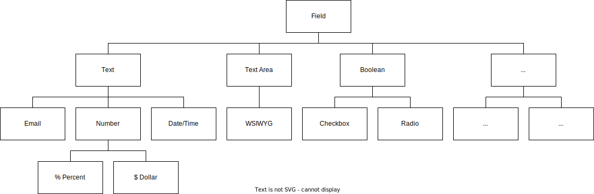
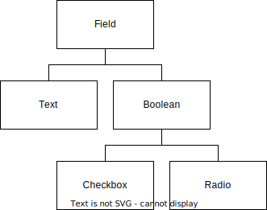
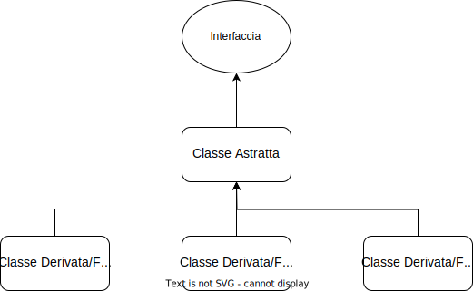
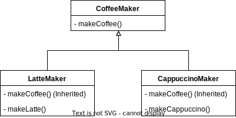
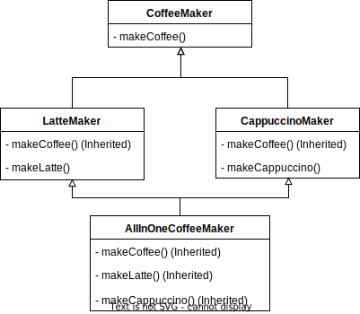

# Introduzione a PHP
PHP sta per *HyperText PreProcessor*, ed è un linguaggio di scripting. La differenza principale tra un linguaggio di scripting e un linguaggio di programmazione sta nella loro esecuzione: se un linguaggio di programmazione deve essere compilato in linguaggio macchina, un linguaggio di scripting deve essere interpretato. Alcuni esempi di lingauggi di programmazione sono Java, C, C++, i quali devono essere compilati per essere eseguiti, mentre PHP e JavaScript per esempio necessitano di un *interpreter*. A differenza di JavaScript, che viene eseguito nel browser del client, PHP richiede un server per essere eseguito.

# PHP 8 Procedurale

## Stampa
La stampa in PHP può essere fatta con il comando `echo 'Hello World';` oppure con `print 'Hello World';`, che a differenza del primo ha un valore di ritorno (che è sempre `1`). Questi comandi possono essere usati anche con delle parentesi, come per esempio
```php
echo('Hello World');
print('Hello World');
```
Quando si usa il comando `echo` senza le parentesi è possibile concatenare più stringhe di testo semplicemente separandole da una virgola, come nel caso di
```php
echo 'Hello', ' ', 'World';
```
Il comando `echo` è marginalmente più veloce di `print`, quindi il suo uso è maggiormente consigliato.

Per stampare una stringa che contiene un apostrofo è possibile escaparlo con `\`, oppure si può inserire l'intera stringa in virgolette, come nel caso di
```php
echo "Bill's News";
```

## Commenti
La sintassi per i commenti utilizza `//` oppure `#` per i commenti inline, mentre usa
```php
/*
	Comment
*/
```
per i commenti multilinea.

## Variabili
Le variabili in PHP sono assegnate per default per valore. Per assegnare una variabile per riferimento è possibile usare la seguente sintassi
```php
$y = &$x;
```

### Singoli e Doppi Apici nelle Stringhe
I doppi apici nelle stringhe sono utili quando questa contiene un singolo apice, in modo da non escaparlo, oppure per stampare variabili senza concatenarle, come nel seguente esempio
```php
$firstName = 'Marco';
echo "Hello $firstName";
```

Per evidenziare la presenza di una variabile in una stringa definita inline è possibile usare le parentesi graffe.
```php
echo "Hello {$firstName}";
```

### Definizione di variabile costante
Una costante è simile ad una variabile, ma il suo valore non può essere cambiato o impostato come `undefined` una volta che è stata definita. Per definire una costante è possibile usare al funzione `define` che accetta come parametri il nome della costante e il suo valore.
```php
define('STATUS_PAID', 'paid');
```
Un altro modo per definire una costante è quello di usare la keyword `const` come segue
```php
const STATUS_PAID = 'paid';
```
La differenza principale tra `define` e `const` è che le costanti create con `const` sono definite al tempo di compilazione, mentre le costanti create con `define` sono definite in runtime. Questo significa che non è possibile definire costanti con `const` all'interno di strutture di controllo (loop, if-else, ecc.) ma è possibile definirle con `define`.
Con `define` è inoltre possibile definire costanti il cui nome è definito in runtime, come nel caso di `define('STATUS_' . $paid, $paid);`.

Per sapere se una costante è stata definita o meno è possibile usare la funzione `defined()`, che accetta come parametro il nome della costante e restituisce un valore booleano true se la costante è stata definita, false altrimenti.

### Doppia variabile
È possibile utilizzare come nome di una variabile il valore di un'altra variabile.
```php
$foo = 'bar';
$$foo = 'baz';
echo $foo, $bar;
```
restituisce `barbaz`.

### Doppia variabile stampa inline
```php
echo "$foo, {$$foo}";
echo "$foo, ${$foo}";
```
La seconda alternativa è deprecata da PHP 8.2, ma è possibile usare la sintassi `{${$foo}}`.

### Strict mode
PHP è un linguaggio dinamicamente tipizzato, a tipizzazione debole, dove non viene richiesto di definire il tipo delle variabili, inoltre il loro tipo può cambiare una volta che sono state definite. In un linguaggio dinamicamente tipizzato il controllo dei tipi accade in runtime, mentre nei linguaggi staticamente tipizzati, a tipizzazione forte, il controllo dei tipi accade in compilazione (come in Java, C, C++).

Per sapere di che tipo è una variabile è possibile usare la funzione `gettype($variableName)`, mentre un modo per stampare tutte le informazioni che PHP ha sulla variabile è quello di usare la funzione `var_dump($variableName)`.

La strict mode serve per evitare casting implicito nel passaggio di parametri e per definire il tipo di parametro.
```php
declare(strict_types = 1);

function sum(int $x, int $y) {
	return $x + $y;
}

$sum = sum('2', 3);
```
Senza strict types PHP cerca di convertire i tipi di dati anche se è stato fatto un type hinting esplicito, però anche con il type hinting può fare casting implicito tra integer e float.
Usare una tipizzazione forte è consigliato, dal momento che indica esplicitamente quali tipi di dati ci si aspetta che la funzione possa accettare.

Per fare un casting esplicito è possibile usare la segunente sintassi
```php
(int) '5'
```
dove si indica il tipo di dato tra parentesi prima del valore da convertire.

### Valori false
I seguenti valori vengono valutati come false se convertiti in booleani.
```php
0 -0
0.0 -0.0
''
'0'
[]
null
```

### Stampa di booleani
```php
echo $isComplete;
```
Se si stampa `false` si ottiene una stringa vuota, se si stampa `true` si ottiene il valore `1`.

### int e float
Sia per gli `int` che per i `float` è possibile usare degli underscore come separatore, per migliorare ad esempio la leggibilità come nel seguente caso
```php
10_000_000
```

I `float` non devono essere mai comparati direttamente, dal momento la conversione in binario introduce degli errori di calcolo che rendono inaffidabile il risultato, come nel caso di `0.1 + 0.2` che risulta in un numero simile a `0.30000000000000004`.

Per utilizzare correttamente i `float` è possibile effettuare un arrotondamento delle somme, che risolve il problema degli errori, con la seguente funzione
```php
$number = 4.123;
echo number_format($number, 2);	// prints 4.12
```
dove si sceglie la precisione dell'arrotondamento, oppure si possono usare tipi di dati `Decimal` che contengono funzioni di arrotondamento built-in, come nel seguente esempio
```php
$decimal = new Decimal("4.123");
echo $decimal->round(2);		// prints 4.12   
```

### `heredoc` e `nowdoc`
Per definire testo su più righe si usa la seguente sintassi, dove con il virgolettato non vengono interpretate le variabili.
```php
// Heredoc
$text = <<<TEXT
Line 1 $x
Line 2 $y
Line 3
TEXT;

//Nowdoc
$text = <<<'TEXT'
Line 1 $x
Line 2 $y
Line 3
TEXT;
```

Per convertire il carattere new line (spesso `\n`) del sistema operativo nel tag new line del browser (`<br />`) è possibile usare la funzione `nl2br($string)`.

### Unset
Per eliminare il valore e la definizione di una variabile è possibile usare il comando `unset($variable)`.
```php
unset($x);
```

### Aggiunta di più elementi ad un array
```php
array_push($programmingLanguages, 'C++', 'C', 'GO');
```

### Chiavi custom in array
```php
$programmingLanguages = [
	'php' => '8.0',
	'python' => '3.9'
];
```

### Non si riconteggiano gli indici
Negli array gli indici non vengono riconteggiati quando di unsettano degli elementi.
```php
$array = [1, 2, 3];
unset($array[0], $array[1], $array[2]);
$array[] = 1;
print_r($array);
```
restituisce `Array ( [3] => 1 )`.

## Operazioni elementari
### Strict comparison
Con `===` si effettua un confronto tra variabili che tiene conto anche del tipo, senza effettuare alcun casting implicito.

### Spaceship Operator
L'operatore `<=>` restituisce 0 se i due numeri sono uguali, -1 se il primo è minore del secondo e 1 se il primo è maggiore del secondo.

### Null Coalescing Operator
L'operatore `??` è utile quando si lavora con valori `null`. Nel seguente esempio
```php
$y = $x ?? 'Hello';
```
la variabile `$y` avrà valore `Hello` solamente se la varaibile `$x` è `null`, altrimenti avrà il valore della variabile `$x`.
Questo operatore è utile quando si ha a che fare con chiavi di un array non definite, infatti questo operatore permette di assegnare un valore alla chiave solamente se questa non è ancora definita.

### Operatore di Controllo degli Errori
L'operatore `@`, se aggiunto ad un'espressione, sopprime i suoi errori. L'utilizzo di questo operatore non è consigliato.

### Post e pre-incrementi
Con la sintassi `x++` si definisce un post-incremento, dove prima viene restituito il valore originale di `x` e poi viene addizionato di `1`. Usando la sintassi `++x` si ottiene invece un pre-incremento, nel quale prima avviene l'incremento e poi la variabile viene restituita.

### Incremento di una stringa
Se si incrementa la stringa `$string = abc` con `++$string` si ottiene la stringa `abd`.

### Valutazione short-circuit
Quando PHP interpreta un'espressione booleana si ferma appena è possibile definire il risultato, senza valutare il resto. Questo è il caso di `true || false`, dove false non verrà valutato dal momento che con il primo true l'espressione è già vera. La stessa cosa accade con `false && true`, dove il secondo true non verrà mai valutato perché già con il primo false l'espressione è falsa.

### Operazioni su array
Si consideri di avere i seguenti array
```php
$x = ['a', 'b', 'c'];
$y = ['d', 'e', 'f', 'g', 'h'];
```

#### Somma
Se si effettua la somma `$x + $y`, all'array x verranno aggiunti gli elementi dell'array y se non ne esistono già nella stessa posizione o con la stessa chiave. In questo caso l'array x contiene già elementi nelle chiavi 0, 1 e 2, quindi questi non verranno inseriti, ma gli elementi g e h in posizione 3 e 4 dell'array y non sono chiavi occupate di x, quindi possono essere aggiunti. Si ottiene quindi `['a', 'b', 'c', 'g', 'h']`.

#### Comparazione
Se si comparano due array con `==` si ottiene true solo se le coppie chiave-valore sono uguali in entrambi, anche se sono in ordine diverso. Con la comparazione stretta `===` i tipi di dati devono essere gli stessi e anche l'ordine deve essere lo stesso.

### Precedenza degli operatori
Come indicato in [questa pagina](https://www.php.net/manual/en/language.operators.precedence.php), l'operatore `&&` ha precedenza maggiore rispetto all'operatore `||`, quindi verrà eseguito sempre per primo senza parentesi.

Sono presenti anche gli operatori `and`, `or` e `xor`, ma la loro priorità è la minore di tutte, anche di quella di `=`. Questo significa che nel codice
```php
$z = $x and $y;
```
prima avverrà l'assegnamento e dopo verrà valutato l'operatore logico (e dal momento che l'assegnamento vale sempre true, `$y` non verrà mai valutato).
Per questo motivo è necessario usare le parentesi come segue
```php
$z = ($x and $y);
```
ed è sempre bene usarle per aumentare la leggibilità del codice ed evitare questi errori.

## Strutture di controllo
Nelle strutture di controllo è sempre bene usare le parentesi graffe, anche se il contenuto è di una sola riga, per migliorare la leggibilità.

### `elseif`
In PHP è presente `elseif`, anche nella forma `else if`, ma è preferibile la prima.

### Strutture di controllo in HTML
Quando si deve stampare del codice HTML all'interno di una struttura di controllo è presente la seguente sintassi
```php
<?php $score = 55 ?>

<?php if ($score >= 90): ?>
	<strong>A</strong>
<?php elseif ($score >= 80): ?>
	<strong>B</strong>
<?php elseif ($score >= 70): ?>
	<strong>C</strong>
<?php elseif ($score >= 60): ?>
	<strong>D</strong>
<?php else: ?>
	<strong>E</strong>
<?php endif; ?>

```
che utilizza i `:` al posto delle parentesi graffe aperte ed elimina le parentesi graffe chiuse, inoltre pone un `endif` alla fine dell'if.

## Cicli
### `break`
Quando si vuole uscire forzatamente da un ciclo si può usare la keyword `break`, che può essere seguita da un numero intero positivo: questo è di default 1 e indica il numero di cicli dai quali si esce. Se infatti viene usata all'interno di un ciclo annidato in un altro ciclo, il comando `break 2` permetterà di uscire sia dal ciclo annidato che da quello principale.

### `continue`
La keyword `continue` serve per skippare l'iterazione corrente del ciclo: quando viene usato, tutto il codice sottostante all'interno del ciclo non verrà eseguito e si passerà alla successiva iterazione.

### Cicli in HTML
Anche nei cicli è possibile usare una sintassi simile a quella degli if quando ci si trova a dover stampare del codice HTML: la sintassi è la seguente
```php
while(...):

endwhile;
```

### `for`
All'interno dell'intestazione del ciclo `for` è possibile inserire più comandi separati da virgola, come segue
```php
$text = ['a', 'b', 'c', 'd']
for ($i = 0, $length = count($text); $i < $length; $i++) {
	echo $text[$i] . '<br />';
}
```
Questa soluzione è conveniente perché evita spreco di capacità computazionale nel calcolare la dimensione dell'array quando questo non cambia.

Il primo campo dell'intestazione viene eseguito solamente una volta all'inizio del for, il secondo campo viene eseguito all'inizio di ogni iterazione e il terzo campo viene eseguito alla fine di ogni iterazione.

### `foreach`
In PHP esiste `foreach` per iterare su oggetti iterabili, con la seguente sintassi
```php
$programmingLanguages = ['php', 'java', 'c++', 'go', 'rust'];
foreach ($programmingLanguages as $language) {
	echo $language . '<br />';
}
```
In questo ciclo è possibile accedere anche alla chiave con la seguente sintassi
```php
$programmingLanguages = ['php', 'java', 'c++', 'go', 'rust'];
foreach ($programmingLanguages as $key => $language) {
	...
}
```

PHP assegna gli elementi alle variabili per valore, quindi non è possibile di base modificare il valore di una variabile proveniente da iterazione. Forzando invece il passaggio per riferimento è possibile fare questa modifica, con la seguente sintassi
```php
$programmingLanguages = ['php', 'java', 'c++', 'go', 'rust'];
foreach ($programmingLanguages as $key => &$language) {
	$language = 'php';
}
```
La variabile iterata non viene distrutta alla fine del `foreach`, il che può causare errori. Per questo è bene distruggerla sempre con `unset($language);`.

Per stampare un array associativo è possibile usare il comando `json_encode` che codifica l'array in JSON (può essere usato su qualsiasi variabile), oppure `implode` (può essere usato solo sugli array associativi).

### `for` e `foreach` in HTML
Anche con `for` e `foreach` è possibile usare la sintassi compatta.

## Switch
```php
$paymentStatus = 'paid';

switch($paymentStatus) {
	case 'paid':
		echo 'Paid';
		break;
	case 'declined':
		echo 'Payment Declined';
		break;
	case 'pending':
		echo 'Pending Payment';
		break;
	
	default:
		echo 'Unknown Payment Status';
}
```
Il `default` non è obbligatorio se non è richiesto dalla logica del programma.

Se si vuole eseguire la stessa azione per più valori della variabile è possibile non inserire alcuna azione nel primo valore e le azioni da compiere nel secondo, come segue
```php
$paymentStatus = 'paid';

switch($paymentStatus) {
	case 'paid':
		echo 'Paid';
		break;
	case 'declined':
	case 'pending':
		echo 'Pending Payment';
		break;
	
	default:
		echo 'Unknown Payment Status';
}
```
In questo caso sia `declined` che `pending` avranno lo stesso effetto.

Lo `switch` è generalmente più veloce perché recupera una sola volta la variabile da controllare, invece dell'`ifelse` che controlla la variabile ogni volta.

Lo `switch` effettua una comparazione `loose`, ovvero non controlla che il tipo sia lo stesso: in questo modo il valore `'1'` della variabile verrà accettato dal caso dello switch che specifica il valore `1`.

## Match
**Introdotto in PHP 8**

Il `match` è un'**espressione** simile allo switch, ma essendo un'espressione restituisce direttamente un valore che può essere assegnato direttamente ad una variabile. La sintassi di `match` considera delle coppie chiave-valore, dove la chiave è il valore della variabile e il valore è l'espressione da ritornare. In `match` non si deve usare `break`.
La sintassi è la seguente
```php
$paymentStatus = 1;

$paymentStatusDisplay = match($paymentStatus) {
	1 => 'Paid',
	2,3 => 'Payment Declined',
	0 => 'Pending Payment',
	default => 'Unknown Payment Status',
};
```
In `match` tutti i valori possibili devono essere presenti, al contrario di `switch`: se questo non è verificato verrà sollevato un errore.

Essendo il valore del match un'espressione, questa può essere anche `print 'Paid'`, ma questo ritornerà 1 dal momento che il valore di ritorno di print è sempre 1. Oltre a questo può essere anche una chiamata a funzione oppure un confronto (dove il valore della chiave sarà quello risultante dal confronto (true o false)).

`match` effettua una comparazione `strict`, quindi compara anche il tipo di dato e solleva un errore se questo è diverso.

## Keyword speciali
### `return`
È possibile usare il `return` anche all'interno del thread principale: in questo caso l'esecuzione dello stesso verrà interrotta. Se non viene specificato alcun parametro per il `return`, quello di default è `null`.

### `declare`
Lo statement `declare` considera tre direttive
- `ticks`: in PHP viene generato un tick per ogni esecuzione di una istruzione elementare. È possibile intercettare questi tick ed eseguire una funzione ogni *n* tick con il seguente codice
	```php
	function onTick() {
		echo 'Tick<br />';
	}

	register_tick_function('onTick');
	declare(ticks = 3);
	```
	dove il numero indica ogni quanti tick viene chiamata la funzione.
- `encoding`: questa direttiva è utile per specificare l'encoding dello script
- `strict_types`: questa direttiva, già descritta in precedenza, serve per disattivare il casting implicito nel passaggio di parametri. Il suo effetto inizia da quando viene dichiarata, inoltre non viene estesa ai file importati, quindi è necessario specificarla anche al loro interno.

## Inclusione di file
In PHP esistono quattro statement per includere file, due `require` (i quali sollevano un *fatal error* se il file non viene trovato) e due `include` (i quali sollevano solamente un *warning* se il file non viene trovato). Ognuno di questi statement ha a sua volta il comando con l'aggiunta di `_once`, che include il file solamente se non è già stato incluso.

Se non viene specificato un path i file vengono cercati nella cartella indicata nel file `php.ini` sotto la sezione `include_path`, e se il file non esiste lì viene cercato nella stessa cartella dove è contenuto lo script.

`include` ha anche un valore di ritorno: se non viene specificato un `return` nel file incluso questo sarà `1` in caso di successo e `false` in caso di fallimento.

Per ottenere il contenuto di un file importato sotto forma di stringa è possibile usare il seguente codice
```php
ob_start();
include 'file.php';
$file = ob_get_clean();
```
In questo modo si evita che il file venga interpretato ed è possibile effettuare delle modifiche ad esso diverse per ogni pagina. Se il contenuto del file è del codice HTML e lo si vuole renderizzare è sufficiente stamparlo con `echo`.

## Funzioni
### Tipo di dato del `return` in funzioni
Per specificare il tipo di dato del return di una funzione si usa la seguente sintassi
```php
function fun(): int {
	return 1;
}
```
mentre se la funzione non deve ritornare niente è possibile specificarlo con
```php
function fun(): void {
	// return; opzionale
}
```

Per specificare che è possibile ritornare sia un valore che null (ad esempio nel caso di un return in una condizione) è possibile usare la seguente sintassi
```php
function fun(): ?int {
	return 1;
	// return null;
}
```
che specifica che la variabile con tipo di dato `int` può essere anche `null`.

Per specificare che è possibile ritornare più tipi di variabili diverse è possibile usare la seguente sintassi
```php
function fun(): int|float|array {
	return ...;
}
```
oppure direttamente la keyword `mixed` che da PHP 8 può valere anche `null`, anche se non è consigliato usarla (tranne quando si usa un tipo di dato non standard in PHP).

### Parametri delle funzioni
Nelle funzioni è possibile specificare i tipi di dato: questi sono utili per il casting automatico oppure per il controllo con lo `strict_types` quando è attivo.
```php
function fun(int $x, int $y) {
	return $x + $y;
}
```

Anche in questo caso è possibile usare i tipi unione specificando più tipi diversi
```php
function fun(int|float $x, int|float $y) {
	return $x + $y;
}
```
È necessario passare nella chiamata della funzione lo stesso numero di argomenti rispetto al numero di parametri specificati nella definizione della funzione (se è attivato lo `strict_types` e si specificano i tipi dei parametri, anche lo stesso tipo di dato).

È possibile impostare dei valori di default dei parametri come segue
```php
function fun(int $x = 0, int $y = 0) {
	return $x + $y;
}
```
specificano di base dei parametri opzionali, ma non è possibile inserire un parametro non opzionale dopo un parametro opzionale, quindi si è costretti a scrivere come segue
```php
function fun(int $y, int $x = 0) {
	return $x + $y;
}
```
e non il contrario.

I parametri sono passati di default per valore, però è possibile passarli anche per riferimento aggiungendo una `&` appena prima del nome della variabile nella definizione della funzione.

#### Funzioni variadiche
Nelle funzioni è possibile non specificare esplicitamente i parametri, ma è possibile creare delle funzioni che accettano tutti gli argomenti della chiamata con l'operatore "splat".
```php
function fun(...$vars) {
	return;
}
```
Nell'array `$vars` saranno contenuti tutti gli argomenti.

È possibile fare un mix di parametri definiti e operatore splat per avere sia una serie finita di parametri obbligatori (o facoltativi) e una serie potenzialmente infinita di altri parametri, inoltre è possibile specificare come per gli altri parametri anche il/i tipo/i di dato/i per i parametri aggiuntivi.
```php
function fun(int $x, int $y, int|float ...$vars) {
	return $x + $y + array_sum($vars);
}
```

### Chiamate di funzione con operatore splat
L'operatore splat è utilizzabile anche per "spacchettare" i valori di un array e passarli separatamente in una chiamata di funzione, come nel seguente esempio
```php
fun($a, $b, ...$vars);
```
Se l'array ha delle chiavi, le chiavi vengono usate come nomi degli argomenti.

### Aggiornamenti in PHP 8
Da PHP 8 è possibile assegnare un nome agli argomenti come segue
```php
function fun(int $x, int $y) {
	return $x + $y;
}

$x = 6;
$y = 3;
fun(y: $y, x: $x);
```
in modo da non dover usare lo stesso ordine di definizione.

È possibile combinare argomenti posizionali e argomenti con nome a patto che gli argomenti con nome siano specificati dopo quelli posizionali.

### Scope delle variabili
Per accedere alle variabili dello scope globale anche all'interno di altri scope che di base non ne avrebbero accesso (es. non è possibile accedere alle variabili con scope globale all'interno di una funzione), si usa la keyword `global` per la variabile alla quale si vuole accedere.
```php
$x = 5;

function fun() {
	echo global $x;
}

fun();
```

PHP salva le variabili globali in un array associativo chiamato `$GLOBALS` dove è possibile modificare anche i valori delle variabili (anche all'interno di scope che non ne avrebbero accesso).

Per evitare che una variabile all'interno di uno scope venga cancellata quando lo scope finisce è possibile usare la keyword `static`. Con un esempio, se si chiama più volte una funzione che richiede molto tempo per calcolare il valore che returna, è possibile "cachare" il valore con la keyword `static` in modo che ad ogni chiamata successiva la variabile esista già e non debba essere ricalcolata.
```php
function getValue() {
	static $value = null;
	if ($value === null) {
		$value = expensiveFunction();
	}

	return $value;
}

function expensiveFunction() {
	sleep(2);

	return 10;
}
```
In questo esempio `$value` verrà calcolato solo una volta, quindi la funzione `expensiveFunction` verrà eseguita una sola volta, e le volte successive verrà usato il valore "cachato".

### Funzioni variabili
In PHP è possibile richiamare il nome di una funzione che non si conosce a priori, come segue
```php
function sum(...) {
	return ...;
}

$x = 'sum';
echo $x(1, 2, 3, 4);
```
In questo esempio verrà chiamata la funzione sum, ma senza che fosse stato noto a priori il nome della funzione nella chiamata.

Per sapere se una variabile contiene il nome di una funzione chiamabile, e quindi esistente, è possibile usare il comando `is_callable($x)` che restituisce un valore booleano.

### Funzioni anonime
PHP supporta la definizione di funzioni anonime come segue
```php
$sum = function ($x, $y) {
	return $x + $y;
};

echo $sum(1, 2);
```
Questo permette di passare le funzioni anonime come parametri di una funzione e ritornarle da una funzione.

Nelle funzioni anonime è possibile accedere alle variabili nello scope genitore usando la keyword `use` e specificando quali variabili si vuole siano accessibili. Queste saranno passate per valore di default, anche se è sempre possibile passarle per riferimento con la `&`.
Questo tipo di funzioni anonime è chiamato *closure*.
```php
$z = 1;
$sum = function ($x, $y) use($z) {
	return $x + $y + $z;
};
```

### Funzioni di callback
Quando una funzione viene passata ad un'altra funzione come argomento e viene poi chiamata in quella funzione, è chiamata "funzione di callback".
Sono disponibili tre metodi per passare una funzione di callback
```php
$array = [1, 2, 3, 4];
$array2 = array_map(function($element) {
	return $element * 2;
}, $array);
```

```php
$array = [1, 2, 3, 4];
$x = function($element) {
	return $element * 2;
};
$array2 = array_map($x, $array);
```

```php
$array = [1, 2, 3, 4];
function fun($element) {
	return $element * 2;
};
$array2 = array_map('fun', $array);
```

Per definire una funzione di callback come parametro in una funzione si usa la seguente sintassi
```php
$sum = function (callable $callback, int ...$numbers): int {
	return $callback(array_sum($numbers));
};

echo $sum('foo', 1, 2, 3, 4);

function foo($element) {
	return $element * 2;
}
```
In questo esempio ogni elemento del vettore viene sommato e il risultato viene moltiplicato per 2.

### Arrow functions
Le arrow function sono state introdotte in PHP 7.4 per definire funzioni anonime con una sintassi più pulita. Questa sintassi è comoda soprattutto quando si definiscono funzioni di callback, come segue
```php
$array = [1, 2, 3, 4]

array_map(fn($number) => $number * $number, $array);
```
Con le arrow function è sempre possibile accedere alle variabili dello scope genitore senza usare la keyword `use`, ma se queste vengono modificate lo saranno all'interno della funzione di callback ma non nello scope genitore.

## Date e tempo
Per ottenere il tempo UNIX in secondi, ovvero il numero di secondi passato dal 1 gennaio 1970, è possibile usare la funzione `time()`.
Sommando o sottraendo secondi a questo numero è possibile ottenere un orario nel futuro o nel passato.

Per ottenere un formato comprensibile all'utente è possibile usare la funzione `date()`, che accetta in input una stringa che indica il formato della data e l'ora (la cui composizione è descritta in [questa pagina](https://www.php.net/manual/en/datetime.format.php)) e il timestamp in secondi UNIX. Se non viene passato un timestamp utilizza di default quello corrente.
Un esempio di questa sintassi è il seguente
```php
date('m/d/Y g:ia', time())
```
che produce una stringa del tipo `12/17/2022 10:34am`.

Per default tutte le date e orari usano la timezone impostata nella configurazione di PHP, ma è sempre possibile sovrascrivere la timezone con il seguente comando in runtime `date_default_timezone_set()` che accetta come parametro un valore di timezone tra quelli in [questa lista](https://www.php.net/manual/en/timezones.php).
Per visualizzare la timezone corrente è possibile usare il comando `date_default_timezone_get()`.
La timezone di default dovrebbe essere sempre UTC (*Coordinated Universal Time*).

Per costruire un valore di data e ora a partire dai singoli valori di giorno, mese, anno, ore, minuti, secondi, ecc. è possibile usare il comando `mktime()`, oppure è possibile convertire una stringa che rappresenta una data in data e ora con `strtotime()`: questa stringa può essere anche `tomorrow`, `last day of february 2020`, `second friday of genuary`, ecc.

Per ottenere i singoli valori di anno, mese, giorno, ore, minuti, secondi, ecc. da una variabile datetime è possibile usare la funzione `date_parse()` che produce un array associativo, mentre per specificare anche il formato in caso di errori si può usare la funzione `date_parse_from_format()` che accetta in input una stringa che rappresenta il formato e la variabile datetime.

## Funzioni sugli array
### sum
PHP prevede numerose funzioni che agiscono sugli array per effettuare operazioni comuni, come la somma di tutti gli elementi con `array_sum($array);`.

### chunk
Per dividere un array in sezioni di lunghezza fissa è possibile usare la funzione `array_chunk()` che accetta in input l'array da dividere, la lunghezza delle sottoporzioni e un valore booleano per preservare o meno le chiavi (di default è false, quindi le chiavi non vengono preservate).

### combine
Per creare un array che abbia come chiavi i valori di un primo array e come valori i valori di un secondo array è possibile usare la funzione `array_combine()`, che accetta in input i due array e solleva un errore se la lunghezza dei due è diversa.

### filter
La funzione `array_filter()` itera su ogni valore dell'array e lo passa alla funzione di callback fornita: se il return della funzione di callback è true allora il valore viene inserito nell'array di return, altrimenti viene scartato.
Per passare le chiavi dell'array originale alla funzione di callback al posto dei valori è possibile usare il parametro `ARRAY_FILTER_USE_KEY` dopo la funzione di callback, mentre se si vogliono passare sia chiavi che valori è possibile usare il parametro `ARRAY_FILTER_USE_BOTH` come segue
```php
$array = [1, 2, 3, 4, 5, 6, 7, 8, 9, 10];

$even = array_filter($array, fn($number, $key) => $number % 2 === 0, ARRAY_FILTER_USE_BOTH);
```
Il risultato di questa funzione è il seguente
```php
Array
(
	[1] => 2
	[3] => 4
	[5] => 6
	[7] => 8
	[9] => 10
)
```
Se non si passa alcuna funzione di callback a filter questa rimuoverà semplicemente i valori false (compresi quelli valutati come false come 0 indicati [qui](#valori-false)).

### values
Se si vuole ricreare gli indici di un array dopo un filter (dal momento che di default rimarranno quelli dell'array originale e potrebbero avere dei gaps) è possibile usare la funzione `array_values` sul risultato del filter, in modo che i valori vengano indexati numericamente. Così si ottiene il seguente risultato
```php
Array
(
	[0] => 2
	[1] => 4
	[2] => 6
	[3] => 8
	[4] => 10
)
```

### keys
Per ottenere le chiavi di un array è possibile usare la funzione `array_keys`, e con la stessa funzione è possibile ottenere tutte le chiavi per specifici valori. Il seguente esempio
```php
$array = ['a' => 5, 'b' => 10, 'c' => 15, 'd' => 5, 'e' => 10];

$keys = array_keys($array, 10);
```
restituirà in output
```php
Array
(
	[0] => b
	[1] => e
)
```
dal momento che b ed e sono le chiavi dove è presente il valore 10.
Di default questa funzione effettua una comparazione debole, ma per attivare la comparazione stretta è possibile usare impostare il suo terzo parametro a `true`.

### map
La funzione `array_map()` applica la funzione di callback a tutti gli elementi dell'array con una sintassi leggermente differente da `array_filter`, dal momento che considera in input prima la funzione di callback e dopo l'array originale.
```php
$array = [1, 2, 3, 4, 5, 6];

array_map(fn($number) => $number * 3, $array);
```
Se viene passato un solo array le chiavi verranno preservate, mentre se se ne passa più di uno le chiavi verranno impostate come numeriche. È possibile infatti passare più di un array come nel seguente esempio
```php
$array1 = ['a' => 1, 'b' => 2, 'c' => 3];
$array2 = ['d' => 4, 'e' => 5, 'f' => 6];

array_map(fn($number1, $number2) => $number1 * $number2, $array1, $array2);
```
Nel caso di array di dimensione diversa, quello con dimensione minore viene espanso con elementi vuoti.
Se viene passato null come funzione di callback verranno creati tanti array quanti sono gli elementi del vettore più lungo, dove ognuno di questi conterrà gli elementi con stesso indice di tutti gli array passati.

### merge
Per unire array diversi è possibile usare la funzione `array_merge`: se gli array hanno elementi con stessa chiave numerica questi non verranno eliminati ma aggiunti in coda, reindexando le chiavi.
Se si hanno invece le stesse chiavi in formato stringa ogni nuovo valore con stessa chiave sovrascriverà il precedente.

### reduce
La funzione `array_reduce` riduce l'array ad un singolo valore usando la funzione di callback passata. Gli argomenti passati sono la funzione di callback e l'array: i parametri della funzione di callback sono il valore di return della callback nella precedente iterazione e il valore dell'array correntemente analizzato. Alla prima iterazione il valore di return sarà null, ma è possibile personalizzarlo con il terzo parametro di reduce.
Con un esempio, nel seguente codice si calcola il prezzo totale moltiplicando il prezzo unitario per la quantità e sommando tutto.
```php
$invoiceItems = [
	['price' => 9.99, 'qty' => 3, 'desc' => 'Item 1'],
	['price' => 29.99, 'qty' => 1, 'desc' => 'Item 2'],
	['price' => 149, 'qty' => 1, 'desc' => 'Item 3'],
	['price' => 14.99, 'qty' => 2, 'desc' => 'Item 4'],
	['price' => 4.99, 'qty' => 4, 'desc' => 'Item 5']
];

$total = array_reduce(
	$invoiceItems,
	fn($sum, $item) => $sum + $item['qty'] * $item['price'],
	0
);
```

### search
È possibile fare ricerche in un array con la funzione `array_search`, la quale restituisce la chiave del primo valore corrispondente all'interrogazione. I parametri sono il valore da cercare, l'array in cui cercarlo e un booleano che indica se fare o no una comparazione stretta, impostato di default a false. Se il valore non viene trovato il risultato della funzione sarà false, che ha stesso valore in una comparazione debole rispetto al trovare il valore nella prima posizione con chiave zero: per questo è sempre bene effettuare una comparazione stretta.

### in_array
Per controllare se un valore esiste in un array è possibile usare la funzione `in_array`, che ritornerà un valore booleano.

### Comparazione
Con la funzione `array_diff()` è possibile comparare gli array: questa funzione compara il primo array con gli altri e restituisce i valori del primo array che non sono presenti negli altri array.
Per comparare anche le chiavi è possibile usare la funzione `array_diff_assoc()`, per comparare solo le chiavi è possibile usare la funzione `array_diff_key()`.

### Ordinamento
Per ordinare i valori di un array è possibile usare la funzione `asort()` alla quale si passa l'array, mentre per ordinare per chiave è possibile usare la funzione `ksort()`. **Queste funzioni modificano l'array originale.**

Per ordinare un array a seconda di una funzione di callback è possibile usare la funzione `usort()` che accetta in input l'array e la funzione di callback con due parametri. La funzione di callback deve restituire
- 0 se a e b sono uguali
- -1 o un numero < 0 se a è minore di b
- 1 o un numero > 0 se a è maggiore di b

Un operatore che effettua automaticamente questo calcolo è il seguente `$a <=> $b`, il quale permette di ordinare il vettore in ordine crescente, mentre se viene usato come `$b <=> $a` ordina il vettore al contrario. Questa funzione non preserva le chiavi.

### Conversione di array in variabili
Per convertire i valori di un array in variabili è possibile usare la seguente sintassi
```php
$array = [1, 2, 3, 4]
list($a, $b, $c, $d) = $array;
```
oppure la sua versione compressa `[$a, $b, $c, $c] = $array`. Per saltare alcuni elementi è sufficiente non assegnarvi alcuna variabile, come segue `[$a, , $c, ] = $array`.
La stessa funzione è utilizzabile su array annidati come segue
```php
$array = [1, 2, [3, 4]]
[$a, $b, [$c, $d]] = $array;
```
Per cambiare l'ordine dell'assegnamento è possibile usare la seguente sintassi
```php
$array = [1, 2, 3]
[1 => $a, 0 => $b, 2 => $c] = $array;
```
che produrrà il seguente output
```php
2, 1, 3
```

## PHP.ini
I parametri di configurazione di PHP si trovano nel file PHP.ini, che ha path diverso in base a sistema operativo e installazione. I parametri sono i [seguenti](https://www.php.net/manual/en/ini.list.php).

Per modificare il valore dei parametri in runtime (per quelli che lo consentono) è possibile usare il comando `ini_set()`, mentre per leggere il valore di qualsiasi parametro è possibile usare il comando `ini_get()`. I parametri modificabili in runtime sono quelli che non presentano la dicitura `PHP_INI_SYSTEM` o `PHP_INI_PERDIR` nella colonna "changeable".

Alcuni parametri utili sono
- `error_reporting`, che specifica quali errori vengono reportati. Durante lo sviluppo è utile per mostrare tutti gli errori nella pagina web (impostazione di default), mentre in produzione è utile per loggarli.
- `display_errors`, che indica se gli errori devono essere visualizzati nella pagina web o no (in produzione questo parametro andrebbe impostato a 0).
- `error_log`, che indica dove vengono loggati gli errori.

## Errori
### Error reporting
Per cambiare il livello di reporting degli errori in runtime è possibile usare la funzione `error_reporting()`: questa accetta come parametro un valore che se impostato a 0 blocca tutti i reporting, mentre se è impostato a `E_ALL` fa il reporting di tutti gli errori (inclusi i warning). Per creare un livello di reporting personalizzato è possibile usare le costanti e gli operatori bit a bit: un esempio è quello nel quale si vuole fare il reporting di tutti gli errori ad esclusione dei warning, dov si userà `E_ALL & ~E_WARNING`.
In sviluppo è molto importante avere attivato `E_ALL`, mentre in produzione è facoltativo ma sempre consigliato.

Per specificare il livello di reporting è possibile usare le [seguenti costanti](https://www.php.net/manual/en/errorfunc.constants.php). Le costanti con la keyword `USER` rappresentano gli errori generati manualmente dalle funzioni di triggering degli errori.

### Error triggering
È possibile triggerare manualmente degli errori con la funzione `trigger_error()` specificando il messaggio di errore e il livello di errore con le keyword specificate prima (es. `trigger_error('Example error', E_USER_ERROR);`). Se si triggera un *fatal error* l'esecuzione del codice viene bloccata, mentre se si triggera un *warning* l'esecuzione del codice continua.
Quando si triggerano errori manualmente è necessario usare le costanti con `user`.

### Error display
Quando viene triggerato un errore PHP sceglie se mostrarlo o meno usando la configurazione presente in `display_errors`. In produzione il display degli errori deve sempre essere spento, tenendo a mente che verranno comunque loggati in un file specifico (se il logging è attivo).

### Error logging
È possibile loggare manualmente un errore con `error_log` passando il messaggio di errore.

### Error handling
PHP permette di implementare un error handler personalizzato: questo deve essere creato come funzione come segue
```php
function errorHandler(
	int $type,
	string $msg,
	?string $file = null,
	?int $line = null) {
		...
		// return ...;
		// exit;
}
```
I parametri della funzione sono i seguenti
- il tipo di errore
- il messaggio di errore
- opzionalmente, il file nel quale si è verificato l'errore
- opzionalmente, la linea di codice nella quale si è verificato l'errore
Per ripassare il controllo all'error handling di default di PHP è possibile returnare false, altrimenti se si ritorna true si indica di procedere con l'esecuzione del codice. Per fermare l'esecuzione del codice si usa `exit`.

Per comunicare a PHP che la funzione deve gestire gli errori si usa il comando
```php
set_error_handler('errorHandler', E_ALL);
```
dove si specifica la funzione di callback e il livello dell'errore. In questo modo si indica a PHP che deve usare quella funzione di error handling per ogni errore, andando a sovrascrivere ogni precedente configurazione (anche quelle che specificavano un reporting di meno errori, es. `E_ALL & ~E_WARNING`).

Per reimpostare l'error handler di default è possibile usare la funzione `restore_error_handler()`.

## File
### Lista di file
Per listare tutti i file e le cartelle contenute in un percorso è possibile usare il comando `scandir()`.

### file o cartella
Per controllare se un elemento è un file o una cartella è possibile usare rispettivamente i comandi `is_file` e `is_dir`.

### Creare o eliminare cartelle
È possibile creare una cartella con `mkdir` con parametri il nome della cartella e i permessi, mentre è possibile eliminare una cartella con `rmdir` con parametro il nome della cartella. La cartella da eliminare deve essere vuota, altrimenti verrà sollevato un errore.

Se si vuole creare una cartella in una cartella è necessario specificare il flag per creare ricorsivamente le cartelle come segue
```php
mkdir('foo/bar', recursive: true);
```

### Controllare se file o cartella esistono
È possibile controllare se un file o una cartella esiste con il comando `file_exists` ed è possibile ottenere la dimensione del file con `filesize()`.

### Scrivere in un file
Per inserire del contenuto in un file è possibile usare la funzione `file_put_contents('nome_file.txt', 'testo')` (che racchiude fopen, fwrite e fclose) oppure è possibile scrivervi solamente con la funzione `fwrite()`.
`file_put_contents` crea il file se non esiste e permette anche di aggiungere il contenuto specificato alla fine del file con il flag `FILE_APPEND` come terzo argomento.

### Cache
Alcuni valori di return delle funzioni che lavorano sui file vengono cachati, come ad esempio il valore di `filesize`. Per questo se si richiede il filesize di un file e poi lo si modifica in runtime, la sua dimensione richiamando filesize sarà la stessa. Per ovviare a questo problema è necessario pulire la cache con il comando `clearstatcache()`.

### Leggere file
Per leggere un file si utilizza la funzione `fopen()` specificando il nome del file e la [modalità di apertura](https://www.php.net/manual/en/function.fopen.php) (per lettura, per scrittura, per entrambi, ecc.).
Il risultato di `fopen` è quello che viene chiamato una **risorsa**, ovvero un tipo di dato che fa riferimento ad una risorsa esterna (un file stream, ecc.).
Specificando l'URL è possibile aprire file remoti, anche se spesso questa funzionalità è disattivata dal server. Se `fopen` fallisce nell'aprire un file o il file non esiste, questa restituisce false e lancia un errore: nonostante ciò è possibile sopprimere l'errore anteponendo una `@` al comando come segue
```php
@fopen('foo.txt', 'r')
```

Per leggere il file linea per linea si usa la seguente sintassi
```php
$file = fopen('foo.txt', 'r');

while(($line = fgets($file)) !== false) {
	echo $line . "<br />"
}
```
Se in questo caso si facesse una comparazione debole il ciclo potrebbe uscire prima del previsto, dal momento che il risultato di `fgets` potrebbe essere valutato come false anche se non lo è.

Un modo per salvare il contenuto di un file in una variabile è quello di leggerlo con `file_get_contents`, che permette anche di specificare un offset (ovvero da dove si comincia a leggere) e una length (che specifica quanti caratteri si leggono).

### Leggere CSV
Per leggere un CSV è possibile usare il comando `fgetcsv`, che fa il parsing delle linee quando le legge e restituisce un array che contiene i campi letti. Il delimitatore di default è `,` ma è possibile specificarlo negli argomenti.

### Chiudere un file
Quando si è finito di lavorare con un file si usa il comando `fclose($file)`.

### Cancellare un file
Per cancellare un file è possibile usare il comando `unlink`.

### Copiare un file
Per copiare un file è possibile usare il comando `copy` che accetta come primo parametro il file di origine e come secondo parametro il file di destinazione. Se il file esiste già viene sovrascritto.

### Spostare un file o cartella
Per spostare un file o una cartella è possibile usare il comando `rename`.

### Informazioni su file
Per avere informazioni su un file è possibile usare il comando `pathinfo`.

# Apache
## Configurazione
Il file di configurazione contiene tutte le direttive che specificano parametri utili ad Apache. I file di configurazione possono essere inclusi uno nell'altro in modo da poterli organizzare meglio.

In [questa pagina](https://cwiki.apache.org/confluence/display/HTTPD/DistrosDefaultLayout) sono presenti le posizioni di tutti i file utili per Apache (configurazione, logging, ecc.).

Non tutte le direttive possono essere inserite ovunque: in [questa pagina](https://httpd.apache.org/docs/2.4/mod/directive-dict.html#Context) sono indicate le varie posizioni nelle quali una direttiva può essere inserita.

Perché le modifiche ai file di configurazine abbiano effetto è necessario riavviare il server Apache.

## Virtual Hosts
Gli host virtuali permettono di mantenere più siti diversi in un solo server: ogni sito può essere specificato per IP o per nome, inoltre è possibile avere più IP per lo stesso sito o più nomi per lo stesso IP.
Un esempio di utilizzo dei virtual host si trova [qui](https://youtube.com/watch?v=ytVPiYILz80&t=312).

## .htaccess
I file .htaccess sono file che permettono di modificare la configurazione di default per la cartella nella quale sono salvati. I file .htaccess non andrebbero usati dal momento che vengono letti ad ogni richiesta, il che aumenta il carico su CPU e disco, inoltre le loro direttive sono specificabili nei file di configurazione generali.

Sono utili solamente quando non si ha accesso ai file di configurazione, come accade ad esempio in alcuni servizi di hosting.

Per indicare al server di non considerare i file htaccess è possibile specificare la direttiva `AllowOverride None` nel file di configurazione principale, per la directory interessata.

Perché le direttive specificate in un .htaccess abbiano effetto non è necessario riavviare il server Apache.

## Semplice routing
Con .htaccess e PHP è possibile creare un semplice sistema di routing: in questo esempio si vuole che l'url `/blog/post1` nel dominio restituisca effettivamente il post 1 del blog. Per fare ciò si rimanda tutto il traffico che arriva alla home del sito (tranne quello a file statici realmente esistenti) ad un singolo file php index.php, che poi effettuerà il routing alla cartella/file giusto.
Il conteunto del file .htaccess è il seguente
```
<IfModule mod_rewrite.c>
	RewriteEngine On

	RewriteCond %{REQUEST_FILENAME} !-d
	RewriteCond %{REQUEST_FILENAME} !-f

	RewriteRule ^ index.php [L]	
</IfModule>
```
e il file `index.php` usa questo comando per rilevare l'URL richiesto
```php
$_SERVER['REQUEST_URI'];
```
In base all'URL richiesto il file PHP può fare un redirect al file corretto oppure chiamare funzioni o API adeguate per presentare il contenuto richiesto.

La stessa identica configurazione può essere inserita anche nel file di configurazione dei virtual host, all'interno di uno degli host virtuali, avendo cura di modificare il percorso all'index come `/index.php`.

Un esempio di questo processo può essere visto [qui](https://youtu.be/ytVPiYILz80?t=440).

# mod.php vs PHP_FPM
## mod.php
Apache include di default il `mod.php`, un interprete PHP eseguito come modulo. Lo svantaggio di questo approccio è che ogni processo Apache richiede più risorse, dal momento che include anche l'interprete PHP, inoltre include l'interprete anche quando la richiesta viene effettuata per file non-PHP (ovvero file statici). Questo problema può essere eliminato sfruttando una CDN.

## PHP-FPM
PHP-FPM è l'acronimo di *PHP Fast CGI Process Manager*, un'implementazione alternativa e più veloce di *fast CGI*: questa è un gateway che si frappone tra il web server e il codice PHP. Quando il file PHP viene richiesto, NGINX comunica con PHP-FPM e gli fa elaborare solo i file PHP (non i file statici). Questo approccio è utilizzabile anche in Apache, ma non è molto comune.

# Docker e NGINX
Per ospitare un server NGINX con PHP-FPM senza installarlo nel sistema principale, è possibile ospitarlo in un container Docker (come mostrato in [questo video](https://youtu.be/I_9-xWmkh28?list=PLr3d3QYzkw2xabQRUpcZ_IBk9W50M9pe-&t=327)).

Docker è un sistema che permette di eseguire applicazioni all'interno di un container, che di base ospita solamente un'installazione base di Linux. Con il file `Dockerfile` è possibile specificare quali applicazioni installare nel container, e con il file `docker-compose.yml` è possibile specificare

## `Dockerfile`
Nel `Dockerfile` è possibile specificare in primo luogo l'immagine da usare, con un identificatore ottenibile dalla [seguente pagina](https://hub.docker.com/) che lista tutte le immagini disponibili pubblicamente.
Oltre a ciò è possibile specificare alcuni comandi da eseguire al primo avvio dell'immagine: nell'esempio vengono eseguiti comandi per installare alcune dipendenze, anche se non sono strettamente necessarie (ci sono solo come esempio).
Come ultima cosa è possibile specificare la cartella di lavoro.

## `docker-compose.yml`
Per lanciare più container insieme è possibile usare lo strumento Docker Compose, specificando cosa deve fare in un file chiamato `docker-compose.yml`.

Nell'esempio si crea un container per NGINX con impostazioni di default e un container per PHP FPM.

In questo file sono specificati anche i volumi come `volumes`: questi sono dei file system montati nel container Docker ma immagazzinati nella macchina host.
Con un esempio, il comando `- ../src:/var/www` mappa la cartella `../src` nella macchina locane nella cartella `/var/www` nel container Docker.

## Docker Compose
Per creare i container specificati nel file `docker-compose.yml` si usa il comando `docker compose up` che deve rimanere in esecuzione perché anche i container rimangano in esecuzione.
Per permettere di eseguire i container anche senza una bash attiva è possibile usare il comando
```
docker compose up -d
```

# PHP 8 Orientato agli Oggetti
Nella programmazione orientata agli oggetti si uniscono funzioni e variabili correlati in una classe, della quale si creano degli oggetti. È possibile accedere agli oggetti e chiamare le funzioni degli oggetti se questi sono pubblicamente accessibili. Nella programmazione orientata agli oggetti le variabili dell'oggetto sono chiamate *proprietà* e le funzioni sono chiamate *metodi*, inoltre gli oggetti sono istanze delle classi.

La programmazione orientata agli oggetti permette di strutturare il codice in modo migliore, rendendolo più semplice da mantenere, testare, estendere, debuggare, ecc.
La programmazione procedurale ha ancora senso in progetti di piccole dimensioni molto semplici, dove lavora una sola persona.

I principi della programmazione orientata agli oggetti sono
- incapsulamento
- astrazione
- ereditarietà
- polimorfismo

## Classi e oggetti
Il tipo di dato oggetto è nativo di PHP.

PHP include un'implementazione generica di classe chiamata `stdclass`, utile per creare oggetti generici o per convertire variabili in oggetti.

Per definire una classe personalizzata è possibile usare la seguente sintassi
```php
class Transaction {
	...
}
```
che comincia con la keyword `class` e il nome della classe (che deve cominciare con una lettera o un underscore ed essere seguito da lettere, numeri o underscore). Per racchiudere la definizione della classe si usano le parentesi graffe. La convenzione per l'assegnamento dei nomi delle classi vuole che questo sia uguale al nome del file che la contiene, e quindi che esista una definizione di funzione per file, ma è possibile avere anche più definizioni dove nessuna ha nome uguale a quello del file.

Per creare un oggetto dalla classe appena creata si utilizza la seguente sintassi
```php
$transaction = new Transaction()
```
dove viene assegnata ad una variabile un'istanza della classe creata con la keyword `new` seguita dal nome della classe. Le parentesi non sono sempre richieste, a seconda di come è fatto il costruttore, ma è sempre bene inserirle per mantenere una sintassi coerente. Se la classe viene istanziata in un file diverso rispetto a quella dove è stata definita è necessario importare il file (il metodo migliore, come già discusso, è `require_once`).

#### Modificatori di accesso
Una classe può avere delle variabili, chiamate proprietà, e delle funzioni, chiamate metodi. Ad ogni proprietà e ad ogni metodo può essere assegnata la visibilità con le keyword `public`, `private` o `protected` (ovvero gli access modifier).
Per aggiungere delle proprietà alla classe è possibile utilizzare la seguente sintassi
```php
class Transaction {
	public $amount;
	public $description;
}
```
In questo caso la visibilità è stata impostata a `public` in modo da poter accedere alle proprietà anche al di fuori della classe. Se si fa un `var_dump` dell'oggetto istanziato da questa classe si ottiene il seguente risultato
```
object(Transaction)#1 (2) { ["amount"]=> NULL ["description"]=> NULL }
```
Il valore delle proprietà è di default NULL, se non ne viene assegnato uno.

Dal momento che le proprietà sono state impostate come pubbliche, per ottenere il loro valore è sufficiente usare l'*object operator* `->` come segue
```php
$transaction->amount
```
ottenendo il valore `NULL`. Se si ponesse il modificatore `private` al posto di `public` si otterrebbe un errore (a schermo e/o nell'error log) dal momento che una proprietà privata non può essere acceduta esternamente alla classe, ma solo al suo interno.

Quando le proprietà sono pubbliche è possibile modificare anche il loro valore, come nel seguente esempio
```php
$transaction->amount = 15;
```

### Typed Properties
Da PHP 7.4 è possibile assegnare i tipi delle proprietà nella loro definizione, come segue
```php
declare(strict_types = 1);

class Transaction {
	public float $amount;
	public string $description;
}
```
Questa possibilità è da preferire, insieme agli strict types. Se si prova ad accedere ad una proprietà non inizializzata, quando a questa è assegnato un tipo, viene sollevato un errore dal momento che la proprietà non può essere acceduta senza essere inizializzata. Lo stesso comportamento si verifica anche ponendo il tipo con `?float` (per specificare che può avere valore null), dal momento che PHP non è in grado di riconoscere se il valore è stato impostato ed è NULL oppure se non è mai stato impostato. Per questo motivo è stato introdotto lo stato `uninitialized`, usato per variabili con tipo definito ma valore non assegnato.

Per risolvere il problema dell'accedere proprietà prima dell'inizializzazione è possibile assegnarvi un valore, direttamente nella definizione oppure nel *costruttore* o *setter*.

### Costruttore
Il metodo costruttore è una funzione speciale, conosciuta anche come *metodo magico*, chiamata quando viene creata una nuova istanza dell'oggetto. La sua sintassi è la seguente
```php
public function __costruct(float $amount, string $description) {
	$this->amount = $amount;
	$this->description = $description;
}
```
Per accedere alle proprietà dell'oggetto o della classe all'interno della classe stessa è necessario usare la variabile `$this`, che fa riferimento all'oggetto chiamante (l'istanza dalla quale l'oggetto è stato chiamato). Il modificatore di accesso del costruttore è `public` di default, inoltre se non ne viene impostato uno è sempre `public` per ogni metodo.

### Metodi
Un metodo utile per la classe `Transacrion` è il seguente
```php
public function addTax(float $rate) {
	$this->amount += $this->amount * $rate / 100;
}
```
che viene chiamato con la sintassi `$transaction->addTax(8)`.

### Getter e setter
Spesso non ha senso che le proprietà di una classe siano pubblicamente accessibili, infatti vengono impostate come private. Per leggerne ed eventualmente impostarne il valore dall'esterno è possibile creare rispettivamente delle funzioni *getter* e *setter*.

### Chaining delle funzioni
Al posto di effettuare le chiamate ai metodi ripetendo sempre il nome dell'oggetto è possibile porle in catena, a patto di aver ritornato l'oggetto corrente per quel metodo. Nei metodi che non ritornano nulla è possibile far ritornare l'oggetto chiamante, ovvero l'istanza della classe, con la variabile `this` come segue
```php
public function addTax(float $rate): Transaction {
	$this->amount += $this->amount * $rate / 100;

	return $this;
}
```
Nel codice chiamante sarà sufficiente utilizzare la seguente sintassi al posto delle chiamate separate
```php
$transaction->addTax(8)->applyDiscount(10);
```
oppure unire anche l'istanziazione
```php
$transaction = (new Transaction(100, 'Transaction 1'))
	->addTax(8)
	->applyDiscount(10);
```
Non è sempre possibile usare il chaining, come nel caso in cui i metodi abbiano già dei valori di ritorno.

### Distruttore
Anche il metodo *distruttore* è un *metodo magico*, il quale serve quando esistono più riferimenti all'oggetto oppure quando questo viene distrutto. La sintassi è la seguente
```php
public function __destruct() {
	echo 'Destruct ' . $this->description . '<br />';
}
```

Il primo caso nel quale il metodo *destruct* viene chiamato da PHP è il seguente
```php
$amount = (new Transaction(100, 'Transaction 1'))
	->addTax(8)
	->applyDiscount(10)
	->getAmount();

var_dump($amount);
```
dove non esiste più un riferimento all'oggetto. In questo caso viene per prima cosa chiamato il metodo *destruct* e poi viene stampato il valore di `amount`, dal momento che era già stato salvato nella variabile prima della distruzione.

Il secondo caso nel quale il metodo *destruct* viene chiamato da PHP è il seguente
```php
$transaction = (new Transaction(100, 'Transaction 1'))
	->addTax(8)
	->applyDiscount(10);

var_dump($transaction->getAmount());
```
nel quale viene prima stampato il valore di `amount` e dopo viene chiamato il metodo *destruct*, che viene chiamato di default alla fine dello script per ogni oggetto.

Un oggetto può essere distrutto manualmente usando la funzione `unset($oggetto)` oppure impostando il suo valore a `null`.

### stdClass
Con un esempio, quando si chiama la funzione `json_decode` senza il secondo parametro impostato a `true`, che permette di convertire la stringa in un array associativo, questa viene convertita in un oggetto della classe `stdClass`, dove le chiavi dell'array sono impostate come le proprietà della classe e i valori sono i valori della proprietà. Per accedere a queste proprietà è possibile usare l'object operator.

È possibile creare anche oggetti con la classe `stdClass` con la seguente sintassi
```php
$obj = new \stdClass();
$obj->a = 1;
$obj->b = 2;
```

### Casting di oggetti
Considerando di avere il seguente array con indici numerici
```php
$arr = [1, 2, 3];
```
è possibile convertirlo in un oggetto con la sintassi regolare per il casting, ovvero
```php
(object) $arr;
```
il quale crea un'istanza della classe `stdClass` con proprietà le chiavi dell'array e valori i valori dell'array. Per accedere a proprietà numeriche di una classe è necessario usare la seguente sintassi `$obj->{0}`.

### Constructor Property Promotion
La *Constructor Property Promotion* è una funzionalità aggiunta in PHP 8.0 che permette di non dover scrivere tutto il codice nel quale si definiscono proprietà che vengono assegnate agli argomenti passati nel costruttore. Questa funzionalità permette di combinare le proprietà della classe, il costruttore e l'assegnamento in una sola sintassi più corta. Si consideri il seguente esempio
```php
declare(strict_types = 1);

class Transaction {
	private float $amount;
	private string $description;

	public function __construct(
		float $amount,
		string $description
	) {
		$this->amount = $amount;
		$this->description = $description;
	}
}
```
Qui è possibile utilizzare la versione compressa, la quale in primo luogo consente di impostare la visibilità direttamente nel costruttore e in questo modo indica a PHP di impostare i valori delle proprietà automaticamente in base a quelli passati nel costruttore.
```php
declare(strict_types = 1);

class Transaction {
	public function __construct(
		private float $amount,
		private string $description
	) {
	}
}
```
Con questa sintassi non è possibile impostare il tipo di una variabile come `callable` (che rappresenta che la variabile sarà una funzione di callback), mentre è possibile farlo nel costruttore se non viene specificata la visibilità (nella definizione delle proprietà non è comunque possibile impostare callable come tipo di dato). È possibile creare un mix di proprietà promosse (ovvero con visibilità impostata nel costruttore) e proprietà non promosse, ovvero con visibilità impostata nella definizione.

Anche nel caso delle proprietà promosse è possibile impostare un valore di default (se il valore di default viene impostato come null il tipo deve essere impostato come nullable).

Con questa sintassi, per accedere ad una variabile nel costruttore non è più necessario usare `this`, anche se è possibile farlo.

### Operatore *Nullsafe*
L'operatore *nullsafe* permette di porre in catena proprietà e chiamate ai metodi anche se uno di questi ritorna null. In questo caso, al posto di ricevere un errore, si riceverà solamente il valore null.
Questo operatore viene posto come `?` subito dopo il nome della proprietà o del metodo che si vuole possa valere null. L'obiettivo è di non creare molti if in catena per il controllo dei null, infatti si shortcircuita appena viene trovato il primo null (ovvero non si valutano le altre espressioni).

## Namespace
Quando si definiscono una funzione, una costante o una classe, senza specificare il namespace, questi vengono posti per default nello spazio globale. Con un esempio, quando si hanno più di una classe con lo stesso nome nello stesso spazio PHP solleverà un errore. La stessa cosa vale per le costanti e le funzioni.

I namespace possono essere pensati come strutture delle cartelle virtuali per organizzare le classi. Un namespace può essere definito all'inizio del file, prima di ogni codice e dopo gli statement di declare. Se ora si chiama una classe definita in un namespace, ma non si specifica il namespace, PHP solleverà un errore perché cerca la classe nel namespace di default ma non la trova. Per specificare un namespace è possibile includerlo nel nome della classe chiamata, con la sintassi `namespace\classe()` oppure importando il file che contiene le funzioni nel namespace scelto.

Spesso i namespace seguono la struttura delle cartelle.

Per importare la classe dal namespace specificato è possibile usare la keyword `use`, seguita dal fully qualifying name della classe (es. `use PaymentGateway\Stripe\Transaction`).

Oltre alle classi è possibile usare i namespace anche su costanti e funzioni, nonostante questa pratica non sia consigliata. La sintassi è la seguente
```php
use const PaymentGateway\Stripe\Transaction;
use function PaymentGateway\Stripe\Transaction;
```

I namespace permettono di istanziare più classi all'interno dello stesso namespace in file diversi, oltre al poter usare classi diverse dello stesso namespace senza specificare tutto il namespace ogni volta.

Se si prova ad istanziare una classe built-in di PHP è necessario porre un `\` prima del nome della classe, per specificare che è nel namespace globale, oppure è possibile importarla con `use NomeClasseBuiltIn;`.

Per caricare una classe di un altro namespace in un file che ha già un namespace è necessario specificare il suo fully qualified name, che deve iniziare con `\`, oppure importare la classe con use specificano il suo fully qualified name.

Quando si chiamano funzioni built-in, queste vengono in primo luogo cercate nel namespace corrente, e se non vengono trovate si usano quelle nel namespace globale. Quando si ridefinisce una funzione built-in è comunque possibile usare quella built-in ponendo prima della chiamata un `\`: questo metodo è preferibile sempre quando si lavora con namespace, anche quando non si ridefiniscono funzioni built-in, dato che si indica a PHP esattamente dove cercarle senza farlo fallire nel cercarle nel namespace.

### Aliasing
Quando è necessario importare due classi con lo stesso nome è possibile definire un alias per le classi con la seguente sintassi
```php
use PaymentGateway\Paddle\Transaction as PaddleTransaction;
use PaymentGateway\Stripe\Transaction as StripeTransaction;
```

Quando si importano più classi dallo stesso namespace è possibile raggrupparle insieme con la seguente sintassi
```php
use PaymentGateway\Paddle\{Transaction, CustomerProfile};
```
in modo da evitare ripetizioni. Un metodo alternativo è quello di importare tutto il namespace e poi chiamare le funzioni ponendo prima del nome l'ultima keyword presente nel fully qualifying namespace: anche in questo caso è possibile creare un alias per l'intero namespace.

Le regole di importazione valgono solamente nel file nel quale sono fatte, infatti se si include un altro file le classi importate non varranno anche per quel file.

## Autoloading
L'importare file uno alla volta quando si sta lavorando con progetti di grandi dimensioni non è la soluzione ottimale: una soluzione alternativa è l'autoloading. PHP prevede la funzione `spl_autoload_register()` che permette di specificare come primo argomento la funzione di autoload: questa funzione riceve il fully qualified class name come argomento e viene eseguita solamente quando sono presenti classi non definite che PHP non sa come caricare. Questo è il caso che si presenta quando non viene caricato alcun file ma viene chiamata una classe da un namespace specifico che PHP non conosce: in questo caso PHP chiama le funzioni di autoload una per una, nell'ordine nel quale sono state impostate.
La sintassi dell'autoloading è la seguente
```php
spl_autoload_register(function($class) {
	...
});
```
dove la variabile `class` contiene il fully qualified name della classe attuale.
Il terzo argomento nella funzione `spl_autoload_register` (`prepend`) è quello che permettere di porre all'inizio della lista l'autoloader specificato, invece che alla fine (dal momento che è possibile specificare più autoload). Per convertire il fully qualified class name nel percorso del file da seguire, se è stata rispettata la convenzione di creare i namespace con la stessa struttura delle cartelle, è possibile usare il seguente codice
```php
spl_autoload_register(function($class) {
	$path = __DIR__ . '/../' . lcfirst(str_replace('\\', '/', $class)) . '.php';
	require $path;
});
```
dove `lcfirst` pone la prima lettera della stringa minuscola (dal momento che tutte le classi sono nella cartella `app` con `a` minuscola) e `'/../'` specifica il percorso dalla carella attuale alla cartella `app` contenente i file che definiscono le classi.

### Standard di programmazione e PSR-4
Gli standard di programmazione PHP sono definiti dal gruppo PHP-FIG e sono consultabili alla pagina [standard](https://php-fig.org/psr/).

Secondo questi standard le funzioni di autoloading non possono creare alcun errore: la funzioni precedente può essere corretta nel seguente modo
```php
spl_autoload_register(function($class) {
	$path = __DIR__ . '/../' . lcfirst(str_replace('\\', '/', $class)) . '.php';
	if (file_exists($path)) {
		require $path;
	}
});
```
in modo da importare il file solo se esiste.

### Composer
Per non dover implementare ogni volta le funzioni di autoloading esiste uno strumento chiamato *Composer*, che gestisce in automatico l'autoloading.

Questo strumento è accessibile in riga di comando, quindi è comodo installarlo nella cartella `/usr/local/bin/` con nome file `composer`. Una volta installato è possibile utilizzarlo da qualsiasi cartella.

Un primo esempio è quello nel quale si installa un pacchetto all'interno di un progetto: in questo caso è necessario porre la CWD nella cartella root del progetto e chiamare il comando `composer require vendor/package`. Questo comando scarica il pacchetto specificato e tutte le dipendenze nella cartella `vendor`, e crea inoltre i file
- `composer.json`: questo è il file di configurazione nel quale vengono poste le dipendenze del progetto, specificando anche la versione che si vuole utilizzare. Per creare questo file è sufficiente il comando `composer init`, che attreverso una serie di domande crea il file. Per installare i pacchetti a partire da questo file si usa il comando `composer install`.
- `composer.lock`: questo è il file che blocca le dipendenze ad uno stato predefinito. Questo file indica tutte le dipendenze del progetto e tutte le dipendenze delle dipendenze, specificando un numero di versione fisso. Questo file deve essere committato nel sistema di versioning in modo che tutti utilizzano le stesse dipendenze. Quando si esegue `composer install`, se esiste un file lock questo viene usato per determinare le versioni delle dipendenze dei pacchetti specificati nel json. Se il file lock non esiste, `composer install` genera il file nello stesso modo in cui lo genera `composer require`. I comandi `composer require`, `composer update` e `composer remove` aggiornano il file lock in modo da aggiornare le dipendenze specificate nel json.

Nella cartella vendor sono presenti tutti i pacchetti scaricati: ognuno di questi prevede un suo file `composer.json`, il quale contiene i requisiti per la produzione e i requisiti per lo sviluppo. La regola è che i requisiti per lo sviluppo non vengono installati quando il pacchetto viene installato come dipendenza di un altro. Questa cartella non deve essere caricata nel sistema di versioning.

La cartella vendor contiene anche il file `autoload.php` che serve per caricare automaticamente tutte le classi delle dipendenze. Questo file deve essere caricato all'interno del file che lo usa.

Per utilizzare classi in un namespace creato da noi è necessario aggiungerlo all'interno della sezione `autoload` del file `composer.json` con la sintassi
```json
{
	"require": {
		"...": "^1.1"
	},
	"autoload": {
		"psr-4": {
			"App\\": "app/"
		}
	}
}
```
e rigenerare i file di autoload di composer con il comando `composer dump-autoload`. Questo metodo utilizza PSR-4, il quale carica automaticamente nuove classi all'interno del namespace. Questo comportamento va bene in sviluppo, ma in produzione esiste una soluzione più veloce, ovvero quella delle classmap: mentre l'autoloading dinamico ha bisogno di controllare il file system prima di risolvere il nome della classe, l'autoloading con classname carica le classi dall'array generato (mappa le classi alla loro posizione). Per generare un autoloading ottimizzato con le classmap è possibile usare il comando `composer dump-autoload -o`, il quale crea un array con tutte le classi. Questo metodo non è ottimale in sviluppo dal momento che richiederebbe di rieseguire il comando ogni volta che si crea una nuova classe. Se la classe non viene trovata nell'array, Composer utilizza il metodo PSR-4 per caricare la classe.

## Costanti nelle classi e Scope Resolution Operator
Le costanti, variabili immutabili il cui valore non è modificabile dopo la definizione, possono essere create anche nelle classi in modo simile alle proprietà, ma seguendo degli standard per mantenere tutti i nomi delle costanti maiuscoli con underscore come separatore.

Un esempio di definizione di una costante in una classe è il seguente
```php
class Transaction {

	public const STATUS_PAID = 'paid';
	public const STATUS_PENDING = 'pending';
	public const STATUS_DECLINED = 'declined';

	public function __construct() {
		...
	}
}
```

Per accedere alle costanti di una classe è necessario fare riferimento anche al nome della classe, oltre che al nome della costante, unendo il tutto con lo *scope resolution operator* (`::`) come segue
```php
echo Transaction::STATUS_PAID;
```

Le costanti delle classi sono allocate nella classe, non nelle istanze, quindi non è necessario creare un'istanza della classe per accedervi, però è possibile accedervi anche negli oggetto, come segue
```php
$transaction = new Transaction();

echo $transaction::STATUS_PAID;
```

Per accedere alle costanti di una classe all'interno della classe stessa è possibile utilizzare il nome della classe, come abbiamo fatto finora, oppure la keyword `self` che fa riferimento alla classe corrente (così come `$this` faceva riferimento all'istanza corrente della classe). Questa keyword può essere utilizzata anche nel return type delle funzioni della classe come segue
```php
public function setStatus(string $status): self {
	...
}
```

Le classi hanno anche una magic constant chiamata `class` che ha come valore il *fully qualified class name*: questa costante può essere chiamata come segue `Transaction::class`.

Le costanti sono utili per assicurarsi che, ad esempio, i parametri di una funzione abbiano uno tra una molteplicità di valori predefiniti: questo è il caso del seguente esempio, dove nella funzione `setStatus` si richiede che sia passato uno dei tre valori possibili.
```php
class Transaction {
	public const STATUS_PAID = 'paid';
	public const STATUS_PENDING = 'pending';
	public const STATUS_DECLINED = 'declined';

	public const ALL_STATUSES = [
		self::STATUS_PAID => 'Paid',
		self::STATUS_PENDING => 'Pending',
		self::STATUS_DECLINED => 'Declined'
	]

	private string $status;

	public function __construct() {
		$this->setStatus(self::STATUS_PENDING);
	}

	public function setStatus(string $status): self {
		if (!isset(self::ALL_STATUSES[$status])) {
			throw new \InvalidArgumentException('Invalid status');
		}

		$this->status = $status;

		return $this;
	}
}
```
La variabile `ALL_STATUSES` è un array con chiave lo stato e valore un messaggio user-friendly. Questo array è chiamato *lookup table*.

Il problema introdotto con questa soluzione è l'accoppiamento che è stato creato tra la classe *Transaction* e lo stato della transazione: dal momento che la classe *Transaction* dovrebbe solamente gestire la transazione, non ha senso inserire in questa anche lo stato della transazione dal momento che per accedervi sarebbe necessario istanziare un'intera transazione (cosa che a volte non è necessaria). Per risolvere questo problema. Un indizio del fatto che la variabile stato non dovrebbe essere nella classe *Transaction* deriva dal fatto che tutte le costanti che rappresentano lo stato iniziano con la parola `STATUS`, quindi è possibile creare una classe a parte solo con lo stato in modo da poter accedere alle costanti con `Status::PAID`. Questa nuova classe può essere inserita nel namespace `App\Enums`, e quindi nella cartella `app/Enums` secondo le convenzioni sui namespace.
Il codice diventerebbe il seguente
```php
class Status {
	public const PAID = 'paid';
	public const PENDING = 'pending';
	public const DECLINED = 'declined';

	public const ALL_STATUSES = [
		self::PAID => 'Paid',
		self::PENDING => 'Pending',
		self::DECLINED => 'Declined'
	]
}

class Transaction {
	
	private string $status;

	public function __construct() {
		$this->setStatus(Status::PENDING);
	}

	public function setStatus(string $status): self {
		if (!isset(Status::ALL_STATUSES[$status])) {
			throw new \InvalidArgumentException('Invalid status');
		}

		$this->status = $status;

		return $this;
	}
}
```
dove nella classe chiamante sarebbe sufficiente il codice `$transaction->setStatus(Status::PAID);`, ovviamente dopo aver importato il namespace con `use App\Enums\Status`.

## Metodi e proprietà statiche
È possibile definire metodi e proprietà statici con la keywork `static`, come nel seguente esmepio
```php
public static int $count = 0;
```
Metodi e proprietà statici sono accessibili nello stesso modo delle costanti, usando lo *Scope Resolution Operator* come nel seguente esempio
```php
var_dump($transaction::$count);
```

In realtà non è necessario che l'oggetto possa accedere ai metodi e proprietà statici della classe, dal momento che questi sono creati e associati alla classe e non ai singoli oggetti: questi appartengono infatti alla classe stessa, e non ad un particolare oggetto o istanza. Per questo motivo è meglio accedere a metodi e proprietà statici dalla classe, come nel seguente esempio
```php
var_dump(Transaction::$count);
```

In altre parole, le proprietà statiche sono considerabili in un certo modo come variabili globali, dal momento che hanno un valore condiviso tra tutti gli oggetti: questo deriva dal fatto che **non sono associati ad un particolare oggetto o istanza, ma alla classe stessa** (a differenza delle proprietà standard che vengono create e associate alla particolare istanza o oggetto dal quale sono create).

Con un esempio, si incrementa `count` ogni volta che viene creata una nuova istanza. Per fare riferimento a metodi o proprietà statiche dall'interno della classe è possibile usare la keywork `self` oppure il nome della classe.
```php
public function __construct(
	public float $amount,
	public string $description
) {
	self::$count++;
}
```
In questo contesto il seguente codice
```php
$transaction = new Transaction(25, 'Transaction 1');
$transaction = new Transaction(25, 'Transaction 1');

var_dump(Transaction::$count);
```
produce il seguente risultato
```php
int(2)
```
dal momento che vengono creati due oggetti della classe.

Se si pone l'oggetto `private` è necessario porre un getter statico per ottenerne il valore, come nel seguente esempio
```php
public static function getCount(): int {
	return self::$count;
}
```
Si noti come in questo caso non è possibile usare la keyword `this`, dal momento che per accedere ad un metodo statico non è necessaria un'istanza della classe.

Lo *Scope Resolution Operator* è utilizzabile solamente per metodi e proprietà statici.

Metodi e proprietà statici non sono ottimali da utilizzare, ma possono essere utili per creare contatori o valori cachati, come nel caso della *memoization*.

### Singleton Pattern
Metodi e proprietà statici possono essere utilizzati per implementare il pattern del *Singleton*, il quale mantiene una sola istanza di una data classe per tutta l'esecuzione della classe. Un esempio è il seguente
```php
class DB {
	public static ?DB $instance = null;

	private function __construct(public array $config) {

	}

	public static function getInstance(array $config): DB {
		if (self::$instance === null) {
			self::$instance = new DB($config);
		}

		return self::$instance;
	}
}
```
In questo esempio si ha una proprietà statica `istance` nullable con tipo classe DB impostata a `null` per default. Il costruttore accetta una configurazione non statica ed ha il modificatore di accesso privato, quindi non è possibile istanziare direttamente la classe DB. Per ottenere un oggetto di DB si usa il metodo statico `getInstance`: questo metodo è implementato in modo da ritornare l'istanza della classe se questa esiste, e ritornare un'istanza appena creata altrimenti.

### Metodi utility
I metodi statici sono usati anche per creare metodi utility che non necessitano di istanze della classe (ad esempio metodi di formattazione che non dipendono dall'oggetto).

### Factory Pattern
Per implementare un pattern Factory è possibile usare metodi statici: questo pattern permette ad una classe di creare oggetti di un'altra classe.
Nel seguente esempio
```php
$transaction = TranscactionFactory::make(25, 'Transaction 1');
```
si lascia al metodo statico `make` della classe `TransactionFactory` il compito di creazione dell'oggetto di classe `Transaction`.

### Svantaggi
Il motivo per il quale si scoraggia l'utilizzo di metodi e proprietà statici è che questi rappresentano quello che è chiamato uno *stato globale*, quindi è possibile modificare i dati o chiamare funzioni statiche in qualsiasi parte del codice, il che può rendere il tutto più facile da mantenere e da testare.
L'alternativa migliore è quella della *Dependency Injection*.

### Vantaggi
I metodi statici possono essere usati nelle funzioni di callback o di *closure* come nel seguente esempio
```php
array_map(static function() {
	$this->$amount = 35;	# errore
}, []);
```
quando non si vuole fornire accesso alla variabile `$this`, e quindi di conseguenza a tutte le proprietà della classe. In questo modo si è sicuri che queste non vengano modificate.

## Quattro Principi Fondamentali
### Incapsulamento
L'incapsulamento unisce dati e metodi che lavorano su quei dati in una sola unità, come ad esempio una classe. In questo modo si nasconde la rappresentazione interna o lo stato dell'oggetto, proteggendo l'integrità dell'oggetto. L'incapsulamento si assicura che l'oggetto gestisca il suo stato, e che niente lo possa cambiare a meno che non sia esplicitamente permesso.

Si consideri come esempio la seguente classe
```php
class Transaction {
	public float $amount;

	public function __construct(float $amount) {
		$this->amount = $amount;
	}

	public function process() {
		echo 'Processing $' . $this->amount . ' transaction';
	}
}
```
che contiene una sola proprietà chiamata `amount` e impostata a `public`.

Come già noto esistono tre *Visibiliy Access Modifiers*
- public, proprietà e metodi sono accessibili al di fuori della classe, da chiunque interagisca con l'oggetto
- private, proprietà e metodi sono accessibili solamente dall'interno della classe
- protected, simile a private ma si estende alle classi figlie e alle sottoclassi

Impostare le proprietà come `public` può rompere il principio di incapsulamento, dal momento che chiunque interagisca con l'oggetto al di fuori della classe ne può modificare lo stato, il che può risultare in bug. In questo modo si permette quello che accade nel seguente esempio
```php
$transaction = new Transaction(25);
$transaction->amount = 125;
$transaction->process();
```
con seguente output
```
Processing $125 transaction
```

Per risolvere questo problema si cambia il modificatore come segue
```php
private float $amount;
```

#### Getter e setter
Se ora si vuole accedere alla proprietà `amount` da fuori la classe è possibile introdurre il metodo pubbico getter come segue
```php
public function getAmount(): float {
	return $this->amount;
}
```
e per modificarne il valore è possibile introdurre il metodo pubblico setter come segue
```php
public function setAmount(float $amount): float {
	$this->amount = $amount;
}
```
Questa soluzione ora però non è molto diversa dall'avere la proprietà pubblica, infatti è necessario scegliere saggiamente quando inserire getter e setter. In generale il loro uso è sconsigliato, infatti è bene tenere l'inserimento dell'amount solamente nel costruttore (o nel metodo che crea l'oggetto), e se è necessario modificarlo si crea direttamente un'altra istanza; il getter viene invece inserito solamente se è strettamente necessario ottenere il valore della proprietà.

##### Vantaggi
Getter e setter sono utili quando si vuole creare il *method chaining*.

#### *Reflection API*
È possibile accedere ad una proprietà anche se questa è privata con la *PHP Reflection API*, che permette di analizzare la costruzione interna delle classi. La sintassi per l'utilizzo è questa
```php
$reflectionProperty = new ReflectionProperty(Transaction::class, 'amount');
$reflectionProperty->setAccessible(true);
$reflectionProperty->setValue($transaction, 125);
var_dump($reflectionProperty->getValue($transaction));
```

### Astrazione
Esistono diversi modi per interpretare la parola astrazione, infatti alcuni di questi fanno riferimento all'astrazione come classi e metodi astratti.
Il principio dell'OOP non fa riferimento allo stesso concetto, infatti si collega all'incapsulamento per nascondere i dettagli implementativi interni di un oggetto dall'utente.

Per sapere se si sta rispettando il principio di astrazione è necessario chiedersi se è possibile effettuare cambiamenti alla classe senza rompere troppe cose al di fuori della classe.

**Mentre l'incapsulamento nasconde lo stato interno, l'astrazione nasconde l'implementazione.**

### Ereditarietà
L'ereditarietà permette di avere una classe derivata (figlio) da un'altra classe (genitore). La classe figlio eredita metodi public e protected, oltre a costanti e proprietà, che possono essere poi sovrascritti. In aggiunta a questi nella classe figlio è possibile avere altre proprietà, costanti e metodi.

#### Esempio del tostapane
Un primo esempio è quello del tostapane, implementato nella seguente classe
```php
namespace App;

class Toaster
{
	public array $slices = [];
	public int	 $size = 2;

	public function addSlice(string $slice): void
	{
		if (count($this->slices) < $this->size) {
			$this->slices[] = $slice;
		}
	}

	public function toast()
	{
		foreach ($this->slices as $i => $slice) {
			echo ($i + 1) . ': Toasting ' . $slice . PHP_EOL;
		}
	}
}
```
In questa classe sono presenti due proprietà pubbliche
- `slices` che salva le fette da tostare
- `size` che indica il massimo numero di fette che il tostapane può tostare nello stesso momento (questa proprietà potrebbe essere stata impostata come costante, ma in questo esempio deve essere sovrascritta e si tratterà più avanti la sovrascrittura di costanti)

oltre ad avere un metodo `addSlice`, che aggiunge le fette all'array `slices` solamente se non è stato raggiunto il numero massimo di fette, e un metodo `toast` che cicla nell'array `slices` e stampa un messaggio indicante che le fette al suo interno stanno venendo tostate.

Nel main si utilizza il seguente codice
```php
require_once '../app/Toaster.php';

use App\Toaster;

$toaster = new Toaster();

$toaster->addSlice('bread');
$toaster->addSlice('bread');
$toaster->addSlice('bread');
$toaster->toast();
```
per verificare che il tostapane può tostare al massimo due fette.
Una soluzione migliore sarebbe quella di lanciare un'eccezione quando la fetta che si vuole inserire non può essere aggiunta all'array perché contiene già il numero massimo di elementi, ma non avendo ancora coperto le eccezioni non è possibile farlo.

Si consideri ora di voler implementare un altro tostapane che può tostare al massimo quattro fette e ha anche una funzionalità per tostare i bagel. Per fare ciò si implementa una nuova classe ToasterPro che è molto simile alla precedente: le uniche cose che vengono modificate sono le seguenti
```php
...
public int	 $size = 4;
...
public function toastBagel() {
		foreach ($this->slices as $i => $slice) {
			echo ($i + 1) . ': Toasting ' . $slice . ' with bagel option<br />';
		}
	}
```
Questo indica che `ToasterPro` è anche un `Toaster`, quindi può tostare il pane con le impostazioni del `Toaster` base ma può anche tostare con l'impostazione bagel e può tostare fino a quattro fette. Dal momento che sono presenti queste caratteristiche, è possibile sfruttare le carattteristiche dell'ereditarietà facendo ereditare la classe `Tosater` in `ToasterPro` con la seguente sintassi
```php
class ToasterPro extends Toaster
```
In questo modo `ToasterPro` eredita tutti i metodi, le proprietà e le costanti public e protected. Grazie a questa aggiunta la classe `ToasterPro` diventa
```php
namespace App;

class ToasterPro extends Toaster
{
	public int $size = 4;

	public function toastBagel() {
		foreach ($this->slices as $i => $slice) {
			echo ($i + 1) . ': Toasting ' . $slice . ' with bagel option<br />';
		}
	}
}
```
sovrascrivendo la proprietà `size`.
Se questa fosse stata impostata a `private` nella classe `Toaster`, non sarebbe stato possibile sovrascriverla dal momento che esiste solamente all'interno della classe nella quale è dichiarata.

Oltre a ciò non è possibile abbassare la visibilità di una proprietà, quindi se questa è impostata a `public` in `Toaster` non è possibile modificarla in `private` in `ToasterPro`, mentre è possibile aumentarla. La stessa regola si applica a metodi, proprietà e metodi statici e costanti.

Come noto, le proprietà `public` non sono ideali dal momento che rompono l'incapsualmento. La soluzione è porle `private`, ma così non posso essere sovrascritte. La soluzione è porle `protected`, così che possano essere sovrascritte dai figli ma non modificate dal chiamante.

Nelle classi create finora non è presente un costruttore, quindi si può pensare di aggiungerlo in modo da inizializzare al suo interno il vettore `slices` e il valore di `size` e 2.
```php
class Toaster
{
	public array $slices;
	public int	 $size;

	public function __construct() {
		$this->slices = [];
		$this->size = 2;
	}

	...
}
```
La stessa cosa si fa nella classe figlio per modificare il valore di `size` (cosa che si può fare perché è impostato a protected).
```php
class ToasterPro extends Toaster
{
	public function __construct() {
		$this->size = 4;
	}

	...
}
```
Ora però, quando si inizializza un nuovo oggetto di classe `ToasterPro`, questa classe non richiama il costruttore della classe padre, quindi l'array `slices` rimane non inizializzato. Per questo è necessario chiamare il costruttore del padre con la seguente modifica
```php
class ToasterPro extends Toaster
{
	public function __construct() {
		parent::__construct();
		$this->size = 4;
	}

	...
}
```
La stessa cosa accade quando si sovrascrive un metodo: per richiamare il metodo della classe genitore si usa la sintassi `parent::addBread()`.

Quando si sovrascrive un metodo in PHP, la *signature* del metodo figlio deve essere compatibile con quella del metodo genitore. Un esempio di violazione di questa condizione è quello di sovrascrittura di uno dei parametri della funzione con tipo di dato diverso, idem per il tipo di ritorno. **Questa regola non si applica al costruttore.**

Per evitare una classe venga estesa è possibile utilizzare la keyword `final` come segue
```php
final class Toaster {
	...
}
```
e lo stesso vale per i metodi
```php
final public function addSlice(string $slice): void {
	...
}
```

PHP non supporta l'ereditarietà multipla, quindi non è possibile estendere da più di una classe, ma supporta l 'ereditarietà multilivello, utilizzabile per l'ereditarietà gerarchica.

#### Esempio delle transazioni e dei pagamenti
Si pensi all'avere una classe transazione dove vengono elaborate transazioni, la quale ha tutte le proprietà e i metodi necessari per l'elaborazione della transazione. Oltre a questa si ha un altro tipo di transazione, ovvero una transazione di rimborso, rappresentata come un'altra classe: questa può avere metodi di rimborso all'intero della classe transazione, ma se c'è una specifica logica su come deve essere effettuato il rimborso può essere necessario rendere la classe di rimborso un'altra classe a parte con le sue funzionalità personalizzate ma che eredita anche tutti i metodi e proprietà necessari dalla classe transazione.

Un altro esempio è quello degli account di pagamento: in questo contesto si considerano possibili due tipi di account, un *checking* account e un *saving* account. Dal momento che questi due account condividono funzionalità comuni è possibile avere *payment* account come classe base, che estende le classi *checking* e *saving* account. Un'altra alternativa è quella di estendere il *saving* account dal *checking* account, ma questo non ha molto senso dal momento che *saving* account non è un *checking* account.

#### Esempio dei campi dei form
Questo esempio considera i diversi tipi di campi presenti nei form rappresentati con una struttura ad albero: la radice sono i *base field*, che hanno delle proprietà e metodi che si applicano ai campi base, che vengono estesi in *text field*, *text area field*, *boolean field*, ecc. Oguno di questi viene esteso ulteriormente con altri campi.


#### Svantaggi
L'ereditarietà può rompere i principi di incapsulamento dal momento che si ha accesso a metodi e proprietà `protected` e `public`.

L'ereditarietà deve essere usata solo quando c'è la proprietà **è un** tra figlio e genitore.

#### Composizione
Quando non è presente la relazione "è un" ma è presente la relazione "ha un" in un verso e "è parte di" nell'altro verso, è possibile usare la composizione per inserire all'interno di una classe metodi presenti in un'altra classe. L'esempio è quello di un forno che ha anche funzionalità di tostapane, il quale viene implementato come segue
```php
class FancyOven {
	public function __construct(private ToasterPro $toaster) {
		...
	}

	public function fry() {
		...
	}

	public function toast() {
		$this->toaster->toast();
	}

	public function toastBagel() {
		$this->toaster->toastBagel();
	}
}
```

### [Polimorfismo](#interfacce-e-polimorfismo)

## Classi e metodi astratti
Una classe astratta è simile ad un template, chiamato classe base, che i figli, chiamati classi concrete, possono estendere attraverso l'ereditarietà.
Le regole generali per classi e metodi astratti sono le seguenti
- una classe astratta non può essere istanziata, ma solo estesa. Questo equivale a dire che non è possibile creare un oggetto della classe astratta.
- una classe astratta può avere metodi astratti che contengono solamente la *signature* del metodo (la definizione) senza l'implementazione. Questo equivale a dire che una classe astratta conosce il "cosa" ma non conosce il "come", implementato nelle classi figlie che implementando i metodi astratti.

A partire dall'esempio precedente


ne viene creata una versione semplificata



Si suppone di implementare la classe base `Field` come segue
```php
class Field {

	public function __construct(protected string $name)
	{
		
	}

	public function render(): string {
		return '';
	}

}
```
notando che non ha una reale implementazione per la funzione `render`, e le altre classi che estendono la classe base con la seguente sintassi
```php
class Text extends Field {

	public function render(): string {
		return <<<HTML
<input type="text" name="{$this->name}" />
HTML;
	}
	
}
```
dove viene solamente sovrascritto il metodo definito nella classe base.
L'unica classe figlia per la quale il metodo `render` non viene sovrascritto è la classe `Boolean`, dal momento che non si è ancora pensato come renderizzare un input boolean
```php
class Boolean extends Field {
	
}
```

Se si implementa il `main` come segue
```php
$fields = [
	new \App\Field('baseField'),
	new \App\Text('textField'),
	new \App\Boolean('booleanField'),
	new \App\Checkbox('checkboxField'),
	new \App\Radio('radioField'),
];

foreach ($fields as $field) {
	echo $field->render() . '<br />';
}
```
si otterrà il seguente codice
```html

<br />
<input type="text" name="textField" />
<br />

<br />
<input type="checkbox" name="checkboxField" />
<br />
<input type="radio" name="radioField" />
<br />
```
dove si vede che, dal momento che l'implementazione di `render` in `Field` e `Boolean` non esiste, non viene stampato nulla per questi due campi.

Questo comporamento non è corretto, dal momento che è possibile istanziare classi che non sono concrete come `Field` e `Boolean`. Per risolvere questo problema è possibile utilizzare le classi astratte con la seguente sintassi
```php
abstract class Field {

	public function __construct(protected string $name)
	{
		
	}

	public function render(): string {
		return '';
	}

}
```
dove la keyword `asbtract` indica a PHP che quella classe non deve poter essere istanziata in quanto astratta.
La classe astratta `Field` ora contiene la funzione `render` che deve essere specificata come astratta: questo accade perché altrimenti questa fornirebbe un'implementazione poco utile, dal momento che ogni classe figlia deve sovrascriverla. Il codice per specificare un metodo come astratto è il seguente
```php
abstract public function render(): string;
```
Ora se si esegue il `main` sarà lanciato un errore che specifica che la classe `Boolean` non implementa il metodo astratto `render`: questo indica che se una classe figlia non implementa il metodo astratto della classe genitore, anche la classe figlia deve essere impostata come astratta. Questo equivale a dire che se si ha almeno un metodo astratto, la classe stessa deve essere dichiarata come astratta.
La classe `Boolean` non deve implementare un suo metodo `render`, dal momento che sarà compito delle sue classi figlie capire come implementarlo, quindi deve essere contrassegnata come astratta.

Nelle classi figlie è possibile aggiungere all'implementazione di un metodo astratto dei parametri di input, a patto che questi abbiano una valore di default.

La visibilità dei metodi astratti non può essere logicamente `private`, ma deve essere per forza `private` e `public`.

Le classi astratte possono essere usate quando si vogliono forzare le classi figlie ad implementare dei metodi, fornendo al contempo delle funzionalità di base con altri metodi non astratti.

## Interfacce e Polimorfismo
Le interfacce possono essere pensate come contratti, i quali definiscono tutte le azioni o metodi necessari che un oggetto deve avere.

Un esempio può essere quello di pensare di ottenere dei soldi da qualcuno che ci e debitore: per fare ciò ci si può affidare a dei servizi esterni che recuperano i soldi, i quali hanno loro processi interni che non ci interessano, fintantoché alla fine riceviamo i soldi. La stessa cosa vale per le interfacce, dove si specifica *cosa* deve essere fatto, ma non come deve essere fatto che viene lasciato all'implementazione dell'interfaccia.

Per creare un'interfaccia si usa una sintassi molto simile a quella della definizione delle classi, con l'eccezione della keywork `class` che diventa `interface`.
```php
interface DebtCollector {
	public function collect(float $owedAmount) : float;
}
```

Dopo aver definito l'interfaccia è necessario specificare una sua implementazione, ovvero una classe concerta che deve implementare tutti i metodi dichiarati nell'interfaccia.
```php
class CollectionAgency implements DebtCollector {
	public function collect(float $owedAmount): float {
		...
	}
}
```

Alcune regole delle interfacce sono le seguenti
- tutti i metodi dell'interfaccia devono essere `public`
- le implementazioni dei metodi devono avere le stesse regole di compatibilità della *signature*

È possibile forzare la presenza di *metodi magici* all'interno delle classi concrete, come ad esempio un costruttore.
```php
interface DebtCollector {
	public function __construct();
	public function collect(float $owedAmount) : float;
}
```

Nell'ereditarietà era possibile estendere una sola classe, mentre nelle interfacce è possibile implementare più interfacce diverse.
```php
class CollectionAgency implements DebtCollector, AnotherInterface {...}
```
Nel caso in cui ci siano più metodi con gli stessi nomi in due interfacce diverse, entrambe implementate nella stessa classe, se la *signature* non matcha o non è compatibile viene sollevato un errore.

Per permettere che un'interfaccia estenda una o più altre interfacce, è possibile usare la keyword `extends` nella definizione dell'interfaccia stessa, inserendo i nomi delle interfacce da estendere.
```php
interface DebtCollector extends AnotherInterface, SomeOtherInterface {...}
```

Nelle interfacce non è possibile avere priprietà, ma è possibile avere costanti.
```php
interface DebtCollector {
	public const MY_CONSTANT = 1;
}
```
Le costanti definite nelle interfacce non possono essere sovrascritte, al contrario di quello che accadeva nell'ereditarietà.

Si pensi ora al caso in cui si vuole avere la possibilità di cambiare gestore di pagamento all'interno di un'applicazione web. Per fare ciò, con i metodi attuali, quando si cambia il gestore è necessario cambiare tutti i nomi che indicano la classe di quel gestore. Se entrambi i gestori implementano però la stessa interfaccia, ovvero l'interfaccia di pagamento, è possibile inserire non il nome della classe dello specifico gestore, ma il nome dell'interfaccia che entrambi implementano. Questo è chiamato **polimorfismo** (più forme): un oggetto può essere considerato polimorfo se può rappresentare più istanze di chi lo implementa (le istanze possono essere verificate con `instanceof`, quindi questo significa di base che l'interfaccia può indicare istanze di classi diverse).
La struttura completa è la seguente

Interfaccia
```php
interface DebtCollector {
	public function collect(float $owedAmount) : float;
}
```

Prima classe che implementa l'interfaccia
```php
class CollectionAgency implements DebtCollector {
	public function collect(float $owedAmount): float {
		$guaranteed = $owedAmount * 0.5;
		return mt_rand($guaranteed, $owedAmount);
	}
}
```

Seconda classe che implementa l'interfaccia
```php
class Rocky implements DebtCollector {
	public function collect(float $owedAmount): float {
		return $owedAmount * 0.65;
	}
}
```

Classe con metodo che accetta in input l'interfaccia, al posto delle classi che la implementano
```php
class DebtCollectionService {
	public function collectDebt(DebtCollector $collector) {
		$owedAmount = mt_rand(100, 1000);
		$collectedAmount = $collector->collect(($owedAmount));
		echo 'Collected $' . $collectedAmount . ' out of $' . $owedAmount;
	}
}
```

Richiamo della funzione che specifica il tipo dell'interfaccia
```php
$service = new \App\DebtCollectionService();
echo $service->collectDebt(new \App\Rocky());
echo $service->collectDebt(new \App\CollectionAgency());
```

Come è stato detto le interfacce sono come contratti, e il polimosrfismo può essere implementato con le interfacce in modo che un oggetto possa assumere più forme. La stessa cosa può essere in realtà fatta con classi astratte e metodi astratti, dal momento che i metodi astratti impognono in un certo modo un contratto alle classi astratte, e il polimorfismo può essere implementato usando classi astrette ed ereditarietà dal momento che un oggetto può passare più istanze diverse. Il problema con questo approccio è il fatto che si è obbligati ad usare l'ereditarietà, la quale non sempre è necessaria.

| Classi astratte | Interfacce |
| --- | ----------- |
| Possono contenere l'implementazione dei metodi | Possono contenere solamente la dichiarazione dei metodi |
| Possono contenere proprietà | Possono contenere solamente e costanti |
| I metodi possono essere anche privati o protetti | I metodi devono essere pubblici |
| Le classi possono enstendere una sola classe astratta | Le classi possono implementare più interfacce |

È possibile avere interfacce nelle classi astratte, come nella seguente immagine, per implementare funzionalità di base nella classe astratta e passare il contratto dell'interfaccia alle classi figlie.


Un esempio, che riprende la [versione semplificata del precedente](#classi-e-metodi-astratti) con una classe astratta `Field`, contenente un metodo astratto `render()`, e i field Text e Boolean, con Checkbox e Radio figli di Boolean.
Il metodo `render()` può essere inserito in un contratto specificato dall'interfaccia `Renderable`, che verrà implementata da tutte le classi che devono renderizzare qualcosa.
```php
interface Renderable {
	public function render(): string;
}
```

Per sapere quando creare un'interfaccia ci si deve chiedere se la classe può avere più implementazioni diverse: se la risposta è si, allora si può creare un'interfaccia. La stessa cosa vale quando ci si trova a creare delle condizioni basate sulla classe genitore (con `instanceof`): in questo caso è possibile usare un'interfaccia come segue. Il vecchio codice
```php
public function foo($x) {
	if ($x instanceof ClassA) {
		...
	} elseif ($x instanceof ClassB) {
		...
	} ...
}
```
diventa
```php
public function foo(CommonInterface $x) {
	...
}
```

## Magic Methods
I Magic Methods sono dei metodi speciali che sovrascrivono il compormaneto di default di PHP quando viene effettuato un certo evento o azione su un oggetto.
La lista dei Magic Methods può essere trovata a [questa pagina](https://www.php.net/manual/en/language.oop5.magic.php), osservando come comincino tutti con un doppio *underscore*.
I più comuni sono i seguenti
- `__get()` viene chiamato quando si prova ad accedere una proprietà o un oggetto non esistente o non accessibile (es. `$invoice->amount` dove `amount` non esiste; il `__get(String $name)` può essere ridefinito nella classe della quale `$invoice` è oggetto, dove `$name` è il nome della proprietà alla quale si sta accedendo, in questo esempio `amount`). Di default quando si prova ad accedere ad una proprietà non esistente si ottiene un errore. 
- `__set()` viene chiamato quando si prova ad assegnare un valore ad una proprietà non definita o non accessibile. Di default quando si prova ad assegnare un valore ad una proprietà non esistente questa viene semplicemente creata, ma questo comportamento può essere cambiato ridefinendo il metodo `__set(string $name, $value)`, dove `$name` è il nome della proprietà alla quale si vuole attribuire un valore e `$value` è il valore da impostare.

Un uso comune è quello di fornire un accesso in sola lettura a proprietà `private` e `protected` sovrascrivendo `__get` (restituendo il suo valore se esiste nell'istanza della classe, e restituendo `null` se non esiste). Questo concetto rompe l'incapsulamento, quindi non è ottimale.
Un utilizzo più sensato e quello di nascondere il fatto che le proprietà sono salvate all'interno della funzione attraverso un array come segue
```php
class Invoice {
	protected array $data = [];

	protected function __get(string $name) {
		if (array_key_exists($name, $this->data)) {
			return $this->data[$name];
		}
		
		return null;
	}

	public function __set(string $name, $value): void {
		$this->data[$name] = $value;
	}
}
```

- `__isset()` viene chiamanto quando vengono usate funzioni come `isset()` o `empty()` su proprietà non definite o non accessibili. Questo metodo deve ritornare un valore booleano, quindi nell'esempio precedente delle proprietà salvate in un vettore sarebbe sufficiente sovrascriverlo come `return array_key_exists($name, $this->data);`.
- `__unset()` viene chiamato quando si usa la funzione `unset()` su proprietà non definite o non acessibili. Questo metodo non deve ritornare nulla, quindi è sufficiente fare l'unset sull'elemento specifico dell'array, quindi `unset($this->data[$name]);`.

Questi quattro Magic Methods non vengono chiamati quando si usano variabili statiche (`App\Invoice::$amount`), dal momento che richiedono un'istanza della classe per funzionare.

- `__call()`: se si prova a chiamare un metodo che non esiste o che non è accessibile su un oggetto si ottiene un errore, ma con questo Magic Method (`__call(string $name, array $arguments)`) è possibile sovrascrivere questo comportamento. Anche questo metodo non viene chiamato quando si fa una chiamata ad un metodo statico (`App\Invoice::process()`).
- `__callStatic()`: simile al Magic Method `__call()` ma utilizzabile per chiamate a metodi statici. Deve essere definito come un metodo statico.

Questi due metodi possono essere usati per chiamare funzioni interne alla classe che non sono accessibili dall'esterno, come nel seguente esempio
```php
protected function process() {
	var_dump('process');
}

public function __call(string $name, array $arguments) {
	if (method_exists($this, $name)) {
		$this->$name();
	}
}
```
In questo caso di può vedere come nel Magic Method viene cercato il metodo nella classe attuale, e se questo esiste viene chiamato. Ora però sorge il problema del passaggio di parametri al metodo che viene chiamato, se ne accetta, come nel seguente caso
```php
protected function process($amount, $description) {
	var_dump('process');
}

public function __call(string $name, array $arguments) {
	if (method_exists($this, $name)) {
		$this->$name($arguments);
	}
}
```
Se si facesse così, la funzione `process` si aspetterebbe un numero come primo elemento, ma otterrebbe un array. Per risolvere questo problema è possibile usare la funzione `call_user_func_array` che accetta come primo elemento un callable, o un array che ha come primo elemento l'oggetto sul quale si vuole chiamare il metodo e come secondo elemento il nome del metodo, e come secondo elemento l'array di parametri da passare al metodo, come segue
```php
public function __call(string $name, array $arguments) {
	if (method_exists($this, $name)) {
		call_user_func_array([$this, $name], $arguments);
	}
}
```

La stessa cosa funziona con `callStatic`. Questi due metodi permettono quindi di differire la chiamata fatta ad un oggetto su un altro oggetto (che non deve essere quindi quello attuale). Un uso interessante è quello di chiamare metodi non statici in modo statico risolvendo l'oggetto all'interno del Magic Method `callStatic` e chiamando il metodo su quell'oggetto. Questo è il funzionamento di base di Laravel.

- `__toString()` viene chiamato quando si prova ad interagire con un oggetto come stringa (ad esempio stampandolo o convertendolo a stringa). Deve restituire una stringa. Da PHP 8 le classi che definiscono questo metodo implemetano anche implicitamente l'interfaccia `Stringable`, quindi sono una sua istanza.
- `__invoke()` viene chiamato quando si prova a chiamare direttamente l'oggetto (ad esempio con `$invoice()`). Questo metodo è molto utile quando si vogliono implementare classi che fanno una sola azione (single responsibility classes, classi responsabili per una sola cosa).
- `__debugInfo()` che dovrebbe ritornare `null` o un array, che dovrebbero essere stampati quando si fa un `var_dump` dell'oggetto. Per default quando si fa un `var_dump` vengono stampate tutte le proprietà con tutti i loro valori, ma se ci sono dati sensibili è possibile nasconderli con questa classe (ad esempio stampando solamente le ultime quattro cifre di un account number).

## Late Static Binding
Il *binding* è di due tipi: early binding, che avviene al tempo di compilazione (PHP è comunque compilato, anche se questa caratteristica viene nascosta al programmatore), e late binding, che avviene al tempo di esecuzione.

Si considerano ora due classi, la classe A e la classe B. La classe A è formata come segue
```php
class ClassA{
	protected string $name = 'A';

	public function getName(): string {
		return $this->name;
	}
}
```
mentre la classe B è formata come segue
```php
class ClassB extends ClassA{
	protected string $name = 'B';
}
```
Nel main le due classi vengono istanziate e viene chiamata per ognuna di esse la funzione `getName()`.
```php
$classA = new ClassA();
$classB = new ClassB();

echo $classA->getName();
echo $classB->getName();
```
Quando questo codice viene chiamato stampa correttamente
```
A
B
```
Questo è un esempio di *late binding*, nel quale le classi sono risolte durante l'esecuzione usando le informazioni di runtime. Per precisare, quando si chiama `getName()` in `$classB` il metodo chiamato è `getName()` di `classA`, però questo usa la proprietà di `classB`: queste sono le informazioni di runtime, necessarie per sapere su quale classe chiamare il metodo e da quale classe ottenere le proprietà.

Ora si prova a rendere le proprietà e i metodi statici, chiamando il metodo staticamente per entrambi le classi. Quando un metodo è statico non è possibile usare la keyword `$this`, dal momento che non esiste un'istanza della classe, quindi è possibile usare la keyword `self`.
```php
class ClassA {
	protected static string $name = 'A';

	public static function getName(): string {
		return self::name;
	}
}
```
```php
class ClassB extends ClassA {
	protected static string $name = 'B';
}
```
```php
echo ClassA::getName();
echo ClassB::getName();
```
Quando si esegue questo codice l'output che si ottiene è il seguente
```
A
A
```
dal momento che viene usato *early binding*. In questo caso la classe viene risolta al tempo di compilazione, e la keyword `self`, non utilizzando un'istanza della classe, prende la proprietà sempre dalla classe genitore.

Un metodo per risolvere questo problema è quello di sovrascrivere il metodo nella classe figlia, stampandovi `self::$name`, come segue
```php
class ClassB extends ClassA {
	protected static string $name = 'B';

	public static function getName(): string {
		return self::name;
	}
}
```
Questo non è ideale, dal momento che vanifica l'ereditarietà.

Questo è il problema che il *late static binding* vuole risolvere (da PHP 5.3 in poi), il quale risolve la classe statica in runtime con il late binding, invece che con l'early binding al tempo di compilazione. Per usare il *late static binding* è sufficiente usare la keyword `static` al posto della keyword `self`, come segue
```php
class ClassA {
	protected static string $name = 'A';

	public static function getName(): string {
		return static::name;
	}
}
```
Il *late static binding* usa informazioni di runtime per determinare come chiamare il metodo, o come accedere proprietà o costanti: quando il metodo è chiamato nel main, PHP salva il nome della classe originale dell'ultima chiamata *non-forwarding*, e quando incontra la keyword `static` risolve alla classe originale che ha salvato in precedenza. Le chiamate *non-forwarding* sono quelle che si fanno quando si specifica direttamente il nome della classe e si usa lo *scope resolution operator* (es. `ClassA::getName()`). Quando invece si usando keyword come `self` o `parent` per accedere a proprietà o chiamare metodi si stanno facendo chiamate *forwarding*, dal momento che si può star forwardando la chiamata alla classe genitore.

La keyword `static` può essere usata anche in un contesto non *static* (il contesto statico è quello nel quale si chiama il metodo staticamente con lo *scope resolution operator*), infatti può essere usata anche quando si chiama un metodo su un oggetto. La differenza è che nel contesto statico la classe è specifiata direttamente, mentre nel contesto di oggetti la classe viene risolta alla classe dell'oggetto chiamante. La differenza tra `static` e `this` in un contesto non statico è che se si chiama il metodo usando la variabile `this`, potrebbe venire chiamato un metodo privato dello stesso scope, mentre usando `static` si potrebbe chiamare un metodo diverso, inoltre non è possibile usare la keyword `static` per accedere a proprietà non statiche. La stessa cosa vale per le costanti: è possibile usare `static` per usare il *late static binding* per accedere costanti sovrascritte. Da PHP 8 è possibile usare la keyword `static` anche come un tipo per il return: questo è utile quando si sta creando una nuova istanza usando la keyword `static` e la si ritorna ad esempio per implementare un pattern *factory*.
Si fa un esempio di questo funzionamento aggiungendo un metodo `make` alla classe `ClassA`, come segue
```php
public static function make() {
	return new ClassA();
}
```
Se si mantenesse tutto così, quando si chiama la funzione `make` dalla `ClassB` viene ritornata un'istanza della `ClassA`, dal momento che si è stati espliciti su quale classe ritornare. Per risolvere questo problema si ritorna
```php
public static function make(): static {
	return new static();
}
```

## *Traits*
PHP è un linguaggio ad ereditarità singola, infatti non supporta ereditarietà multipla (quindi è possibile entendere solamente una sola classe). Nonostante ciò è possibile avere un comportamento simile a quello dell'ereditarietà multipla grazie ai *traits* (o interfacce).

Si consideri in primo luogo il seguente contesto



In questo caso i metodi `makeCoffee` sono ereditati dalla classe genitore, mentre `makeLatte` e `makeCappuccino` sono specifici delle classi figlie.

Si consideri ora di voler aggiungere una *all-in-one* coffee maker che includa `makeCoffee`, `makeLatte` e `makeCappuccino`. Secondo l'ereditarietà, sarebbe possibile pensare di estendere sia `LatteMaker` che `CappuccinoMaker` nella classe `AllInOneCoffeeMaker`, ma in PHP non esiste l'ereditarietà multipla.



L'ereditarietà multipla è affetta da un problema, chiamato *Diamond Problem* (dal momento che le classi sono poste visivamente con una forma di diamante): in questo problema, se si overrida il metodo `makeCoffee` sia in `LatteMaker` che in `CappuccinoMaker` e non lo si overrida in `AllInOneCoffeeMaker`, quest'ultima non sa quale dei due metodi overridati eseguire. I linguaggi che supportano l'ereditarietà mmultipla risolvono questo problema in modi diversi, mentre PHP supporta i *Traits* che permettono di condividere funzionalità comuni tra più classi.

In codice l'esempio diventa il seguente
```php
class CoffeeMaker {
	public function makeCoffee() {
		echo static::class . ' is making coffee<br/>';
	}
}
```

```php
class LatteMaker extends CoffeeMaker {
	public function makeLatte() {
		echo static::class . ' is making latte<br/>';
	}
}
```

```php
class CappuccinoMaker extends CoffeeMaker {
	public function makeCappuccino() {
		echo static::class . ' is making cappuccino<br/>';
	}
}
```

Con il seguente codice nel main
```php
$coffeeMaker = new \App\Traits\CoffeeMaker();
$coffeeMaker->makeCoffee();

$latteMaker = new \App\Traits\LatteMaker();
$latteMaker->makeCoffee();
$latteMaker->makeLatte();

$cappuccinoMaker = new \App\Traits\CappuccinoMaker();
$cappuccinoMaker->makeCoffee();
$cappuccinoMaker->makeCappuccino();
```
l'output è il seguente
```
App\Traits\CoffeeMaker is making coffee
App\Traits\LatteMaker is making coffee
App\Traits\LatteMaker is making latte
App\Traits\CappuccinoMaker is making coffee
App\Traits\CappuccinoMaker is making cappuccino
```

Un modo per permette alla classe `AllInOneMaker` di fare tutti i tipi di caffe, includo il regular, è quello di usare le interfacce: in primo luogo sarebbe necessario creare un'interfaccia per `LatteMaker` chiamata `MakesLatte`, la quael include la definizione del metodo `makeLatte`, il quale viene implementato sia nella classe `LatteMaker` che in `AllInOneCoffeeMaker`, e la stessa cosa varrebe per `CappuccinoMaker`.

```php
class LatteMaker extends CoffeeMaker implements MakeLatte {
	public function makeLatte() {
		echo static::class . ' is making latte<br/>';
	}
}
```

```php
class CappuccinoMaker extends CoffeeMaker implements MakeCappuccino {
	public function makeCappuccino() {
		echo static::class . ' is making cappuccino<br/>';
	}
}
```

```php
class AllInOneCoffeeMaker extends CoffeeMaker implements MakeLatte, MakeCappuccino {
	...
}
```

Il problema con questa soluzione è che si deve fornire l'implementazione concreta per `makeLatte` e `makeCappuccino` sia nelle loro rispettive classi che nella classe `AllInOneCoffeeMaker`, e se l'implementazione è la stessa si sta duplicando il codice. Le interfacce sono quindi una buona soluzione quando l'implementazione è diversa.

Per risolvere questo problema ci sono i *Traits*, il cui scopo principale è quello di ridurre la duplicazione del codice e aumentare il riutilizzo del codice.
Per creare un Trait si usa una sintassi simile a quella delle classi, con la keyword `trait` al posto della keyword `class`, e per usarla si usa la sintassi `use LatteTrait;`. Il codice diventa il seguente
```php
class LatteMaker extends CoffeeMaker {
	use LatteTrait;
}
```

```php
trait LatteTrait {
	public function makeLatte() {
		echo static::class . ' is making latte<br/>';
	}
}
```
ed è uguale per `CappuccinoMaker`.

In primo luogo è necessario sapere che non si possono istanziare oggetti di *Trait*, ma è necessario usare i traits in altri traits o in classi.
Con i trait è possibile far funzionare la classe `AllInOneCoffeeMaker` come segue
```php
class AllInOneCoffeeMaker extends CoffeeMaker {
	use LatteTrait, CappuccinoTrait;
}
```
Questa sintassi non segue lo standard PSR12, infatti quella corretta per questo standard richiede di importare ogni trait in una riga separata.

Da quanto visto finora è possibile considerare i trait come un copia-incolla, il quale prende il codice indicato nel trait e lo inserisce nella classe che usa quel trait al tempo di compilazione.

Si possono ridefinire i metodi definiti nei trait: se un metodo presente in un trait viene implementato anche nella classe che utilizza questo trait, il metodo rifefinito nella classe avrà la precedenza su quello definito nel trait, quindi lo andrà a sovrascrivere.
Se il metodo è definito nella classe base ma non è sovrascritto nella classe figlia che usa un trait con la stessa definizione del metodo, il metodo nel trait ridefinisce il metodo della classe base.
L'ordine di precedenza è quindi
1. metodo della classe definito nella classe
2. metodo del trait definito nel trait (a patto che la classe di 1 utilizzi il trait)
3. metodo base definito nella classe genitore di 1, se esiste

Un problema simile a quello presente nell'ereditarietà multipla esiste anche nei trait, ed è quello per il quale due metodi sono in conflitto perché hanno lo stesso nome.
Si supponga che `CappuccinoTrait` abbia anche il metodo anche `makeLatte` (che è definito anche in `LatteTrait`). Quando si arriva ad `AllInOneCoffeeMaker`, che utilizza sia `LatteTrait` che `CappuccinoTrait` questa non sa quale dei due `makeLatte` usare.
Questo problema è risolto in PHP dall'operatore `insteadof`, il quale specifica quale metodo usare nel caso in cui ci sia un conflitto. Se nell'esempio si volesse eseguire `makeCoffee` del `LatteTrait` e non del `CappuccinoTrait` si potrebbe usare la sintassi
```php
class AllInOneCoffeeMaker extends CoffeeMaker {
	use LatteTrait {
		LatteTrait::makeLatte insteadof CappuccinoTrait;
	}
	use CappuccinoTrait;
}
```

Un altro modo per risolvere il problema è quello di creare un alias per il metodo, cambiandogli di fatto il nome. Si supponga di voler usare `makeLatte` anche da `CappuccinoTrait`, ma con nome diverso. La sintassi sarebbe la seguente
```php
class AllInOneCoffeeMaker extends CoffeeMaker {
	use CappuccinoTrait {
		CappuccinoTrait::makeLatte insteadof LatteTrait;
	}
	use LatteTrait {
		LatteTrait::makeLatte as makeOriginalLatte;
	}
}
```

Un'altra soluzione ancora è quella di cambiare la visibilità dei metodi. Se il metodo `makeCappuccino` in `CappuccinoTrait` fosse private, sarebbe ancora possibile poterlo usare nella classe che usa il trait, ma non sarebbe possibile poterlo chiamare nel main. Per risolvere questo problema è possibile cambiare la visibilità del metodo `makeCappuccino` all'interno della classe che usa il trait.
```php
class CappuccinoMaker extends CoffeeMaker {
	use CappuccinoTrait {
		CappuccinoTrait::makeCappuccino as public;
	}
}
```
In questo modo, quando il metodo `makeCappuccino` viene incollato nella classe `CappuccinoMaker` diventa public.
Questa soluzione è altamente sconsigliata.

Come anticipato, è possibile usare Traits in altri Traits. Oltre a ciò, è possibile anche definire proprietà all'interno dei trait, le quali sono accessibili sia nel trait, sia nelle classi che usano il trait.
```php
trait LatteTrait {
	protected string $milkType = 'whole-milk';

	public function makeLatte() {
		echo static::class . ' is making latte with ' . $this->milkType . PHP_EOL;
	}
}
```
Seguendo le regole dei conflitti, la classe che usa il trait non può ridefinire la stessa proprietà con lo stesso nome, a meno che non sia completamente compatibile (ovvero che la visibilità, il tipo e il valore iniziale devono essere uguali).

Spesso è possibile fare riferimento all'interno dei trait a proprietà che non sono definite in essi, ma che ci si aspetta siano definite nella classe che usa il trait. Un esempio è il seguente
```php
trait LatteTrait {
	public function makeLatte() {
		echo static::class . ' is making latte with ' . $this->milkType . PHP_EOL;
	}
}
```
dove ci si aspetta che `$milkType` sarà definito nella classe che usa il trait. Questo comportamento non è consigliato. Una soluzione migliore è quella di far implementare alla classe che usa il trait un metodo che restituisce il valore della proprietà che è utile: per fare questo si definisce semplicemente il metodo del trait.
```php
trait LatteTrait {
	public function makeLatte() {
		echo static::class . ' is making latte with ' . $this->getMilkType() . PHP_EOL;
	}

	public function getMilkType(): string {
		return 'whole-milk';
	}
}
```
Se questo metodo non è però definito si sta hardcodando il valore nel trait, il che non è ottimale. Se nella classe che usa il trait è possibile che sia definita una proprietà `$milkType`, è possibile usare il seguente codice per ottenerne il valore.
```php
public function getMilkType(): string {
	if (property_exists($this, 'milk-type')) {
		return $this->milkType;
	}
	return '';
}
```
Questa soluzione non è ancora ottimale, dal momento che ha lo stesso problema della precedente.

Un altro modo per approcciare il problema, nonostante anche questo non sia consigliato, è quello di [creare metodi astratti](https://www.youtube.com/watch?v=PMruqUC4Qpc&t=1240s) nel trait.
```php
abstract public function getMilkType(): string;
```
In questo modo ci si assicura che ogni classe che usa il trait fornisca un'implementazione concreta del metodo.
Nella parte sull'ereditarietà era stato detto che se una classe ha un metodo astratto, allora tutta la classe deve essere segnata come astratta. In questo caso non è vero, dal momento che non è necessario impostare la classe che usa quel trait come astratta.

Una soluzione migliore è quella di definire la proprietà come privata nel trait, e di inserire un setter nel caso in cui il suo valore debba cambiare.

Da PHP 8.0 in poi è possibile definire metodi astratti privati nei trait, il che non è possibile nelle classi astratte quando si definiscono metodi astratti.

Anche nei traits è possibile avere metodi e proprietà statici. Quando un trait ha una proprietà statica, ogni classe che usa quel trait ha una sua istanza indipendente della proprietà, a differenza dell'ereditarietà dove la proprietà è condivisa.

La magic class `__CLASS__` quando usata in un trait viene risolta come la classe che usa quel trait.

Un altro esempio di utilizzo dei trait è quello nel quale un metodo della classe `Customer` e un metodo della classe `Invoice` richiedono del codice per inviare email. Questo codice può essere lo stesso, quindi è possibile utilizzare qualche meccanismo per evitare di duplicarlo. Una prima soluzione è quella di creare una classe `Mail` che viene estesa da entrambe le classi precedenti, ma logicamente non ha senso dal momento che sfrutta l'ereditarietà in modo sbagliato. Come detto, perché una classe possa estendere un'altra classe deve valere la relazione "is a", e qui `Customer` is not a `Mail`.
La soluzione ottimale è quella di usare il trait `Mail`.

## Classi Anonime
PHP supporta le classi anonime, che per definizione non hanno un nome. Per creare una classe anonina è possibile usare la seguente sintassi
```php
$obj = new class {
	# Elementi standard delle classi
};
```
Le classi anonime posso anche accettare argomenti nel costruttuore, come segue
```php
$obj = new class(1, 2, 3) {
	public function __construct(int $x, int $y, int $z) {
		...
	}
};
```
e questi argomenti possono esseer promossi a proprietà
```php
$obj = new class(1, 2, 3) {
	public function __construct(public int $x, public int $y, public int $z) {
		...
	}
};
```
infatti un `var_dump` dell'oggetto di questa classe ha il risultato seguente
```
object(class@anonymous)#3 (3) {
	["x"] =>
	int(1)
	["y"] =>
	int(2)
	["z"] =>
	int(3)
}
```

Le classi anonime posso usare anche ereditarietà ed estendere altre classi, implementare interfacce, usare trait, ecc. come ogni altra classe.
Il nome di una classe anonima viene generato e assegnato dall'engine: un esempio di nome è il seguente `string(45) "class@anonymous/var/www/public/index.php:5$0"`. Questo nome non è molto comodo da usare, quindi si assume che non esista, e per questo non è possibile fare type hinting della classe. Quello che si può fare è far implementare un'interfaccia alla classe anonima e fare type hinting su quella, come nel seguente esempio
```php
$obj = new class(1, 2, 3) implements MyInterface {
	public function __construct(public int $x, public int $y, public int $z) {
		...
	}
};

foo($obj);

function foo(MyInterface $obj) {
	...
}
```
Il type hinting può essere fatto sull'oggetto generico `object`.

Le classi anonime possono essere usate anche all'interno di altre classi, creando una sorta di annidamento. Un esempio è il seguente
```php
class ClassA {
	public function __construct(public int $x, public int $y) {
		
	}

	public function foo(): string {
		return 'foo';
	}

	public function bar(): object {
		return new class {};
	}
}
```
All'interno della classe anonima non è possibile accedere alle proprietà e ai metodi della classe principale (dal momento che sarebbe necessario usare la sintassi `$this->x`, ma `$this` fa riferimento alla classe corrente, ovvero quella anonima). Per avere accesso alle proprietà (e ai metodi) della classe principale è possibile passarle nel costrutture della classe anonima ed estendere la classe principale nella classe anonima.
```php
class ClassA {
	public function __construct(public int $x, public int $y) {
		
	}

	...

	public function bar(): object {
		return new class extends ClassA {
			public function __construct(public int $x, public int $y) {
				parent::__construct($x, $y);
			}
		};
	}
}
```
Se non si vuole usare l'ereditarietà e non si vuole estendere si hanno due opzioni: la prima consiste nel passare le proprietà come argomento nel costrutture, come segue
```php
public function bar(): object {
	return new class($this->x, $this->y) {
		public function __construct(public int $x, public int $y) {
			...
		}
	};
}
```
mentre la seconda consiste nel passare l'oggetto corrente
```php
public function bar(): object {
	return new class($this) {
		public function __construct(ClassA $myObj) {
			...
		}
	};
}
```

Gli use case principali per le classi anonime sono i seguenti
- rendono semplici i *mocking test*, i quali consistono nel creare un'implementazione di un'interfaccia al volo, evitando l'uso di complesse API di *mocking*
- mantengono l'uso delle classi al di fuori dello scope all'interno del quale sono definite
- evita di usare l'autoloader per implementazioni banali

## Salvataggio delle variabili e Comparazione di Oggetti
In PHP ci sono più modi per comparare oggetti
- *comparison operator* (`==`): questo operatore effettua una semplice comparazione, quindi due oggetti comparati con questo operatore risultano uguali se sono istanze della stessa classe, con stesse proprietà e valori. I valori sono compararti in modo *loose*, quindi anche se nel costrutture della classe è specificato il tipo di dati, se non sono attivati gli *strict types* PHP proverà comunque a fare casting dei tipi di dati, per cui la comparazione `1 == true` risulterà vera.
- *identity operator* (`===`): utilizzando questo operatore due oggetti risultano uguali se puntano o fanno riferimento alla stessa istanza della stessa classe.

Usando il *comparison operator* il seguente codice
```php
$invoice1 = new Invoice(1, 'My Invoice');
$invoice2 = new Invoice(true, 'My Invoice');

var_dump($invoice1 == $invoice2);
```
ha come risultato `true`.

Usando l'*identity operator*, per ottenere true il codice deve essere il seguente
```php
$invoice1 = new Invoice(1, 'My Invoice');
$invoice2 = $invoice1;

var_dump($invoice1 === $invoice2);
```
dal momento che entrambe le variabili puntano allo stesso oggetto in memoria (entrambe le variabili sono puntatori ad una locazione di memoria che contiene l'oggetto). Questo significa che questa sintassi non crea una copia dell'oggetto.

Quando una variabile viene creata in PHP, questo salva il nome della variabile separatamente dal suo valore. Il nome è salvato infatti in una *symbol table*, quindi ogni variabile è una simbolo e ogni variabile ha una entry in questa tabella. Ogni entry in questa tabella punta ad un qualche tipo di container o struttura dati, che contiene il valore della variabile. La variabile è quindi un semplice puntatore che punta alla struttura dati. Il container o struttura dati all'interno del quale la variabile è salvata è chiamato *zend value* (*zval*), una struttura scritta in C che salva informazioni sulla variabile, come il tipo e il valore (o il riferimento).

I valori per tipi semplici, come `int`, sono salvati direttamente nel container *zval*, ma per gli oggetti viene salvato solamente un *object identifier*, ovvero un puntatore che punta ad un'altra struttura dati complessa, l'*object store*, che contiene effettivamente l'oggetto.

Quando viene creata `$invoice2 = $invoice1`, viene creata una nuova variabile `invoice2` che viene inserita nella *symbol table*, il quale container *zval* viene semplicemente copiato da `invoice1`. Entrambi i container contengono lo stesso *object identifier*, quindi puntano alla stessa posizione in memoria nella quale l'oggetto è effettivamente salvato.

Questo è il motivo per il quale a volte si dice che gli oggetti sono passati di default per riferimento, ma nella realtà non è vero dal momento che sono passati, ritornati e assegnati di default per valore.

Nel caso in cui si comparino due oggetti, uno di una classe e uno di una classe che estende la prima, entrambi gli operatori di comparazione restituiranno `false`, dal momento che gli oggetti sono oggetti di classi diverse.

Se una classe contiene una proprietà che è oggetto di un'altra classe, la comparazione è fatta ricorsivamente. Questo è il caso del seguente codice
```php
$invoice1 = new Invoice(new App\Customer('Customer'), 25, 'My Invoice');
$invoice2 = new Invoice(new App\Customer('Customer'), 25, 'My Invoice');

echo 'invoice1 == invoice2' . PHP_EOL;
var_dump($invoice1 == $invoice2);

echo 'invoice1 === invoice2' . PHP_EOL;
var_dump($invoice1 === $invoice2);
```
che restituisce
```
invoice1 == invoice2
bool(true)
invoice1 === invoice2
bool(false)
```
Questo accade perché il *comparison operator* compara i valori di tutte le proprietà, anche di quelle dell'oggetto annidato, e questi sono tutti uguali. Se il valore della proprietà della classe annidata forse riverso verrebbe returnato  `false`.
La comparazione ricorsiva comporta errori nel caso in cui ci siano relazioni circolari.

## Docblock
Il [docblock](https://docs.phpdoc.org/3.0/guide/guides/docblocks.html) è un tipo particolare di blocco di commento associabile a funzioni, metodi, classi, interfacce, variabili, proprietà, ecc.
La sintassi è la seguente
```php
/**
 * Docblock
 * 
 * @param
 * @return
 */
```
e permette di aggiungere documentazione al codice. Queste strutture possono essere anche usate per generare automaticamente documentazione di API, oppure dagli API per fornire un migliore completamento automatico, ecc. oltre a rendere il codice più chiaro. I tag più comuni nei docblock sono i seguenti
- `@param`, il quale documenta l'argomento di una funzione o un metodo.
- `@return`, il quale documenta il tipo di ritorno

Questi tag sono utili se non si fa type hinting esplicito, o semplicemente se si vuole fornire informazioni aggiuntive circa gli argomenti o i tipi di ritorno.
Se ci si aspetta che un argomento possa essere di più tipi, o che un metodo possa ritornare più tipi, prima di PHP 8 era necessario usare i docblock con il carattere `|` per specificare più tipi (`int|float`), mentre da PHP 8 è possibile usare i tipi unione per fare type hinting su più tipi.

- `@throws` indica quale eccezioni ci si aspetta che il metodo o la funzione lanci
- `@var`, usato per documentare il tipo di proprietà, variabili e costanti.

Quest'ultimo è molto utile per fare type hinting e permettere all'IDE di fornire autocompletamento migliore. La prima opzione è la seguente
```php
/** @var Customer $obj */
foreach($arr as $obj) {
	$obj->name;
}
```
mentre una meno invasiva, utile solamente se questo codice è all'interno di una funzione e `$obj` viene passato nella funzione, è il seguente
```php
/**
 * @param Customer[] $arr
 */
public function foo(array $arr) {ì
	foreach($arr as $obj) {
		$obj->name;
	}
}
```
dove con `Customer[]` si indica che `$arr` è un array di oggetti di tipo `Customer`.

Un altro utilizzo di `@var` è quello di fare type hinting sulle proprietà di una classe, come segue
```php
/** @var Customer */
	private $customer;
```
anche se da PHP 7.4 è possibile fare type hinting direttamente nella dichiarazione della proprietà come segue
```php
	private Customer $customer;
```

- `@property` e `@method`, che permettono ad una classe di sapere quali magic methods e proprietà sono disponibili.
```php
/**
 * @property int $x
 * @property float $y
 * @property-read int $xx
 * @property-write float $yy
 */
```
Questo docblock specifica quali sono le proprietà della classe, utile nel caso in cui venga utilizzata la classe come astratta in modo da fare un autocompletamento corretto. Si noti come ci sono anche indicazioni per sola lettura o sola scrittura.
```php
/**
 * @method int foo(string $x)
 * @method static int foo(string $x)
 */
```

Nessuno di questi tag fornisce validazione, ma può dare indicazioni all'IDE o a dei framework specifici.

## Cloning di Oggetti e Magic Method Clone
In PHP ci sono più modi per creare un nuovo oggetto per una classe: il primo è quello visto finora, che usa la keyword `new` seguita dal nome della classe, un altro è quello di usare la keyword `new` seguita da `self` o `static`, come nel seguente esempio
```php
public static function create(): static {
	return new static();
}
```
un altro ancora è quello di usare un altro oggetto, come in `$invoice2 = new $invoice();`.

Per clonare un oggetto in PHP è necessario usare la keyword `clone`, come in `$invoice2 = clone $invoice`. Con clone si crea un'altra variabile, la quale punta ad un oggetto in memoria che è una copia esatta dell'originale, ma ha ovviamente locazione in memoria diversa e quindi è puntato da un puntatore che ha valore diverso.
Quando un oggetto viene clonato viene chiamato il magic method ``__clone()` (e non il costruttore), il quale come ogni altro magic method può essere ridefinito. Questo è utile nel caso in cui nella classe sia presente un identificatore univoco, il quale nell'oggetto clonato deve essere diverso.

## Serializzare Oggetti e Magic Method di Serializzazione
Per serializzazione si intende il processo di conversione di un valore in formato stringa. In PHP è possibile serializzare quasi ogni valore, inclusi gli oggetti, ma non è possibile serializzare tipi di risorse o closure, così come alcuni oggetti built-in di PHP.

Per serializzare un valore è possibile usare la funzione `serialize` come segue
```php
echo serialize(true) . PHP_EOL;
echo serialize(1) . PHP_EOL;
echo serialize(2.5) . PHP_EOL;
echo serialize('hello world') . PHP_EOL;
echo serialize([1, 2, 3]) . PHP_EOL;
echo serialize(['a' => 1, 'b' => 2]) . PHP_EOL;
```
ottenendo il seguente risultato
```php
b:1;
i:1;
d:2.5;
s:11:"hello world";
a:3:{i:0;i:1;i:1;i:2;i:2;i:3;}
a:2:{s:1:"a";i:1;s:1:"b";i:2;}
```

Una volta che un valore è serializzato, è possibile usare la funzione `unserialize` per ottenere l'effetto contrario, come nel seguente esempio
```php
var_dump(unserialize(serialize(['a' => 1, 'b' => 2]))) . PHP_EOL;
```
ottenendo il seguente risultato
```
array(2) {
  ["a"]=>
  int(1)
  ["b"]=>
  int(2)
}
```

La serializzazione può essere utile per il passaggio di valori di PHP, oppure anche per il salvataggio nel database, o in un'altra locazione, per un uso futuro.
Quando si effettua la serializzazione di oggetti verranno serializzate le sue proprietà e valori, insieme al nome della classe, ma non i metodi. In questo modo, se si serializza un oggetto di una classe e lo si salva da qualche parte, è necessario assicurarsi che la definizione della classe e i metodi necessari esistano prima di effettuare l'unserialize della stringa, altrimenti si ottengono errori. Con un esempio, la serializzazione `echo serialize($invoice)` restituisce `O:11:"App\Invoice":1:{s:15:"App\Invoiceid";s:21:"invoice_6479a96b8dfff";}`. In questo esempio è possibile vedere come il nome della classe viene prefisso al nome della proprietà, dal momento che questa è impostata come privata. Se la proprietà fosse protetta verrebbe prefisso un asterisco (`*id`), se fosse pubblica non verrebbe prefisso nulla.
Se si unserializza la serializzazione dell'oggetto si ottiene quanto segue
```
object(App\Invoice)#2 (1) {
  ["id":"App\Invoice":private]=>
  string(21) "invoice_6479aa4c03576"
}
```
Quando si unserializza un oggetto nella realtà ne viene creato uno nuovo, il quale non punta all'indirizzo di memoria del vecchio. Questo metodo può essere quindi usato per creare una copia di un oggetto, infatti il `clone` effettua una *shallow copy*, mentre la sequenza serializzazione->unserializzazione effettua una *deep copy*.

Se per qualsiasi ragione una stringa non può essere unserializzata la funzione restituisce false e solleva un errore. Questo può essere un problema, dal momento che anche l'unserializzazione di una stringa che serializza un valore booleano false restituisce false, quindi non è possibile sapere se il valore effettivo della serializzazione era false oppure se la serializzazione è fallita e la funzione ha restituito false. Un modo per risolvere questo problema è comparare la stringa serializzata al valore booleano false, e se sono uguali la stringa contiene la serializzazione di false. Un altro modo per risolvere il problema è quello di usare l'*error handling* per catturare l'[errore](https://www.php.net/manual/en/function.unserialize.php#refsect1-function.unserialize-returnvalues) `E_NOTICE` e gestirlo in modo specifico.

Il funzionamento di `serialize` e `unserialize` può essere sovrascritto, come è utile nel caso ad esempio di un codice segreto che si vuole cifrare quando l'oggetto viene serializzato e si vuole decifrare quando viene deserializzato.
Per fare ciò un primo metodo è quello di implementare l'interfaccia `Serializable`, la quale richiede di reimplementare i metodi `__serialize()` e `__unserialize()`. Questo metodo è stato deprecato in PHP 8.1, e verrà deprecato in PHP 9. Per ottenere lo stesso risultato si possono ridefinire i metodi `__sleep()`, `__wakeup()`, `__serialize()` e `__unserialize()`.
- `__sleep()` viene chiamato prima che avvenga la serializzazione. Questo metodo permette di inserirsi nell'evento di pre-serializzazione in modo da specificare esattamente quali elementi devono essere serializzati, e restituisce un array contenente i nomi delle proprietà che si vogliono serializzare. Un esempio di implementazione è il seguente
```php
public function __sleep(): array {
		return ['id', 'amount'];
	}
```
- `__wakeup()` viene chiamato appena dopo che è avvenuta la deserializzazione. Quando si serializza un oggetto, non vengono serializzate risorse come connessioni al database e simili, quindi è possibile usare questo metodo per ripristinare le connessioni e le risorse perse durante la serializzazione.

I magic method `__serialize()` e __`unserialize()` sono stati introdotti in PHP 7.4 e risolvono alcuni problemi introdotti con i metodi `__sleep` e `__wakeup` e l'interfaccia `Serializable`. Questi possono essere pensati come una combinazione di `__sleep`, `__wakeup` e dell'interfaccia `Serializable`.
- `__serialize()` viene chiamato prima della serializzaione, così come accadeva `__sleep`, e ritorna un array. La differenza tra `__sleep` e `__serialize` è che quest'ultimo deve ritornare un array che rappresenta l'oggetto, spesso un array associativo, che può contenere informazioni aggiuntive rispetto alle proprietà. Se viene implementato sia il metodo `__sleep()` che il metodo `__serialize()`, quest'ultimo avrà la precedenza e il primo verrà ignorato. Un esempio di questa funzione è il seguente
```php
public function __serialize(): array {
	return [
		'id' => $this->id,
		'amount' => $this->amount,
		'description' => $this->description,
		'creditCardNumber' => base64_encode($this->creditCardNumber),
		'foo' => 'bar'
	];
}
```
- `__unserialize()` viene chiamato dopo la deserializzazione. Questo metodo, a differenza di `__wakeup()` ha in input come argomento i dati che sono stati serializzati, e questo permette di reinizializzare le proprietà, restorare le connessioni, ecc. Se viene implementato sia il metodo `__wakeup()` che il metodo `__unserialize()`, quest'ultimo avrà la precedenza e il primo verrà ignorato. Un esempio di questa funzione è il seguente
```php
public function __unserialize(array $data): void {
	$this->id = $data['id'];
	$this->amount = $data['amount'];
	$this->description = $data['description'];
	$this->creditCardNumber = base64_decode($data['creditCardNumber']);
	var_dump($data);
}
```

## OOP Error Handling
Gestione degli errori nella programmazione Orientata agli Oggetti

Un'eccezione è semplicemente un oggetto di una classe di exception che descrive un errore, il quale interrompe il normale flusso di esecuzione del codice.
Le eccezioni in PHP possono essere lanciate manualmente usando la keyword `throw`, oppure possono essere risultato di qualche errore in fnzioni built-in, classi o codice custom. Le eccezioni possono essere lanciate solamente se l'istanza dell'oggetto lanciato è una classe di tipo `exception` o una istanza dell'interfaccia `throwable`.

Un primo esempio di eccezione è quello che utilizza la classe base per le eccezioni `Exception`, come segue
```php
if ($amount <= 0) {
	throw new \Exception('Invalid invoice amount');
}
```
In questo caso il codice viene usato all'interno del metodo `process` della classe `Invoice` per controllare che l'`amount` della fattura sia accettabile. Si nota come non si dovrebbero mai comparare valori booleani direttamente, come spiegato nella sezione [int e float](#int-e-float). L'errore sollevato è il seguente, nel caso in cui l'`amount` sia minore o uguale a 0.
```
Fatal error: Uncaught Exception: Invalid invoice amount in /var/www/app/Invoice.php:61
Stack trace:
#0 /var/www/public/index.php(175): App\Invoice->process(-25)
#1 {main}
  thrown in /var/www/app/Invoice.php on line 61
```

La classe usata per questo esempio è molto generica. Essa include le proprietà `$message`, `$code`, `$file` e `$line`, sovrascrive il metodo `__clone()` come vuoto, vietando di fatto il clone e l'override dell'oggetto di `Exception`, ed include nel costruttore i parametri `$message`, `$code` e `$previous` che indica l'eccezione precedente (il che permette di linkare le eccezioni tra di loro).
Nello stesso file dove è definita la classe `Exception` è definita anche la classe `Error`, e si può vedere che entrambe implementano l'interfaccia `Throwable`. `Exception` è la classe base per tutte le eccezioni, e queste possono includere eccezioni definite dall'utente, mentre la classe `Error` è la classe base per le eccezioni degli *internal error* di PHP. Dal momento che entrambe implementano l'interfaccia `Throwable` possono essere intercettate.


L'eccezione vista finora è molto generica, ma è possibile essere più specifici nel contesto dell'esempio precedente. Quello che si sta cercando di fare infatti è lanciare un'eccezione perché l'argomento non è valido, e PHP ha un'eccezione esattamente per questo caso d'uso.
```php
if ($amount <= 0) {
	throw new \InvalidArgumentException('Invalid invoice amount');
}
```
con output
```
Fatal error: Uncaught InvalidArgumentException: Invalid invoice amount in /var/www/app/Invoice.php:62
```
La classe di `InvalidArgumentException` estende la classe `LogicException`, la quale estende a sua volta `Exception`. In linea generica è possibile dire che tutte le eccezioni sono basate sulla classe `Exception`, a meno che non siano gli errori interni di PHP. Pensando ora di voler lanciare un'eccezione anche quando le informazioni del cliente sono mancanti si può pensare di usare la stessa eccezione, come nel seguente esempio
```php
if(empty($this->customer->getBillingInfo())) {
	throw new \InvalidArgumentException('Missing billing information');
}
```
ma in realtà questo non è logicamente il caso corretto per l'uso di questa eccezione, dal momento che `$customer` non è un *argument*.
Le eccezioni disponibili sono le seguenti
- BadFunctionCallException
- BadMethodCallException
- DomainException
- InvalidArgumentException
- LengthException
- LogicException
- OutOfBoundsException
- OutOfRangeException
- OverflowException
- RangeException
- RuntimeException
- UnderflowException
- UnexpectedValueException

e si può vedere se una risponde alle necessità, altrimenti si può sempre lanciare l'eccezione base. Questo non è un comportamento consigliato, dal momento che con l'eccezione base, o con un'eccezione sbagliata, si stanno omettendo informazioni o dando informazioni scorrette. La soluzione migliore è quella di creare una classe di eccezioni custom, la quale estende le funzionalità della `Exception` di base o una delle classi di eccezioni built-in.
```php
class MissingBillingInfoException extends \Exception {
	protected $message = 'Missing billing information';

}
```

```php
if(empty($this->customer->getBillingInfo())) {
	throw new MissingBillingInfoException();
}
```

```
Fatal error: Uncaught App\Exception\MissingBillingInfoException: Missing billing information in /var/www/app/Invoice.php:67
```
 
Quando viene lanciata un'eccezione ma non c'è alcun blocco `catch`, questa risale lo stack delle chiamate fino alla funzione che ha causato originariamente l'errore, o fino a quando trova un blocco `catch`. Se questo non è presente cerca il *Gobal Esception Handler*, e se questo non è impostato l'esecuzione viene fermata con un *fatal error*.

### Try-Catch
Le eccezioni possono essere catturate con il blocco `try-catch`. Un blocco `try` deve avere almeno un `catch` o deve avere un blocco `finally`, il quale viene chiamato ogni volta, senza considerare se l'eccezione è stata lanciata o no. Il blocco `catch` è quello che permette la continuazione dell'esecuzione dello script, a meno che non venga lanciata un'eccezione da dentro il blocco stesso. Un'opzione è quella di loggare l'eccezione e poi continuare l'esecuzione, un'altra è quella di bloccare l'eccezione e rilanciarla, oppure lanciarne un'altra, ecc.
```php
try {
	$invoice->process(25);
} catch (MissingBillingInfoException $e) {
	...
}
```
Il blocco `catch` ottiene in input l'oggetto dell'eccezione, il quale può essere usato per ottenere informazioni circa l'errore.
```php
try {
	$invoice->process(25);
} catch (MissingBillingInfoException $e) {
	echo $e->getMessage() . ' ' . $e->getFile() . ':' . $e->getLine() . PHP_EOL;
}
```
```
Missing billing information /var/www/app/Invoice.php:67
```

Da PHP 8 non è più necessario ottenere l'oggetto della classe di errore, come nel caso in cui non sia necessario usarlo.
```php
try {
	$invoice->process(25);
} catch (MissingBillingInfoException) {
	echo 'Error';
}
```

Per catturare più tipi di eccezione e gestirli separatamente è possibile avere più blocchi `catch`.
```php
try {
	$invoice->process(-25);
} catch (MissingBillingInfoException $e) {
	echo $e->getMessage() . PHP_EOL;
} catch(InvalidArgumentException $e) {
	echo $e->getMessage() . PHP_EOL;
}
```
Quando si usano più blocchi `catch`, l'esecuzione del codice continua dopo che il primo blocco `catch` è stato eseguito, a meno che il blocco `catch` stesso non lanci un'eccezione. Se si lancia un'eccezione `InvalidArgumentException` da dentro il blocco `catch` del `MissingBillingInfoException`, questa non verrà catturata, dal momento che un blocco `catch` è già stato eseguito. Per catturarla è necessario inserire un altro blocco `try-catch` più in alto nello stack.
Se la gestione di più eccezioni è la stessa è possibile catturarle nella stessa riga usando il carattere `|`.
```php
try {
	$invoice->process(25);
} catch (MissingBillingInfoException|InvalidArgumentException $e) {
	echo $e->getMessage() . PHP_EOL;
}
```
Dal momento che entrambe queste eccezioni sono un'estensione della classe base `Exception` è possibile catturarle tutte usando direttamente questa classe.
```php
try {
	$invoice->process(25);
} catch (\Exception $e) {
	echo $e->getMessage() . PHP_EOL;
}
```

Se si vuole eseguire del codice, sia che l'eccezione sia catturata sia che non lo sia, è possibile usare il blocco `finally`. Questo blocco viene eseguito in qualsiasi caso. Se si ha un valore di return all'interno dei blocchi `try` o `catch`, questo verrà ritornato alla fine dell'esecuzione del blocco `finally`, mentre se si ha il return anche nel `finally` il valore che verrà ritornato sarà quello del `finally`, nonostante gli altri return vengano comunque eseguiti (quindi se si fa una chiamata di funzione dei return in `try` o `catch`, questa verrà eseguita anche se alla fine il valore del return sarà quello del `finally`).

Per riassumere, quando viene lanciata un'eccezione questa risale lo stack delle chiamate finché trova un blocco `catch` compatibile, se esiste. Dopo aver eseguito il codice nel `catch`, se esiste, viene eseguito tutto il codice nel `finally`, ed infine se nessun `catch` ha catturato l'eccezione viene eseguito il *Global Exception Handler*, se è impostato. Se questo non è impostato viene lanciato un *fatal error*.

### Global Exception Handler
I *Global Exception Handler* possono essere registrati usando la funzione `set_exception_handler()`, la quale accetta come parametro il nome di una funzione o una funzione di *closure* che verrà usata come callback.
```php
set_exception_handler(function(\Throwable $e) {
	var_dump($e->getMessage());
});
```
La funzione di callback accetta un singolo argomento, che è l'oggetto dell'eccezione lanciata, il quale si type hinta con l'interfaccia `Throwable`. Questo viene fatto perché non tutte le eccezioni estendono la classe base `Exception`. Prima di PHP 7 gli errori interni non venivano segnalati con dell eccezioni, ma da PHP 7 e con PHP 8 per quasi tutti gli errori vengono lanciate eccezioni.

Ci possono essere due tipi di eccezioni: il primo sono le espressioni normali, le quali possono essere definite dall'utente o presenti di default in PHP, e il secondo tipo sono le eccezioni per gli errori.
Pe capire meglio questa differenza è possibile vedere la gerarchia delle eccezioni in PHP, aggiornata con PHP 7
- Throwable
	- Error
		- ArithmeticError
			- DivisionByZeroError
		- AssertionError
		- CompileError
			- ParseError
		- TypeError
			- ArgumentCountError
		- ValueError
		- UnhandledMatchError
		- FiberError
	- Exception
		- ...

In questa divisione si vede come entrambi i tipi di eccezioni derivino dalla classe `Throwable`, quindi è corretto inserirla per catturare qualsiasi tipo di eccezione. Nele versioni di PHP precedenti alla 7, sarebbe stato corretto usare `Exception`, dal momento che era la classe base per ogni eccezione, sia normale che di errore.

I *Global Exception Handler* permettono di catturare qualsiasi eccezione specificata, anche se non è in un blocco `try-catch`.

### Classe di Eccezioni con *Factory*
In alcuni framework è comune usare delle classi di eccezioni custom con metodi statici che agiscono come *factory* per creare oggetti di eccezione.
```php
if(empty($this->customer->getBillingInfo())) {
	throw CustomException::missingBillingInfo();
}
```
Un caso nel quale questa pratica è utile è quello nel quale non si vuole essere troppo specifici circa l'eccezione custom, ma si vuole usare un'eccezione generica correlata al dominio. Di logica, al posto di creare una classe per ogni eccezione, è possibile creare una sola classe di eccezioni per ogni dominio che racchiude tutte le eccezioni possibili.
```php
class InvoiceException extends \Exception {

	public static function missingBillingInfo() {
		return new static('Missing billing info');
	}

	public static function invalidAmount() {
		return new static('Invalid invoice amount');
	}
	
}
```
```php
if ($amount <= 0) {
	throw Exception\InvoiceException::invalidAmount();
}
if (empty($this->customer->getBillingInfo())) {
	throw Exception\InvoiceException::missingBillingInfo();
}
```

## DateTime
Per gestire i datetime è possibile usare il modo *Object Oriented* proposto da PHP. Come prima cosa, è possibile creare un oggetto datetime come segue
```php
$dateTime = new DateTime();
```
il quale accetta come parametri opzionali
- una stringa datetime, i quali formati validi sono gli stessi che valgono anche per le funzione di conversione da stringa a tempo, come per esempio `tomorrow`, `next tuesday`, `last day of month`, `tomorrow noon`, `10/10/2021 7:00`, ecc.
- la timezone, il quale è un oggetto della classe `DateTimeZone`. I nomi delle timezone supportati sono i [seguenti](https://www.php.net/manual/en/timezones.php). Se non viene specificata viene usata quella di default, ovvero `UTC`.

Al posto di fare un `var_dump` sull'oggetto `DateTime` è possibile anche semplicemente formattare la data con il metodo `format`, il quale accetta la stringa di formato come argomento. I formati validi sono gli stessi che vengono passati nella funzione `Date`, ovvero i [seguenti](https://www.php.net/manual/en/datetime.format.php).

Oltre a questo, è possibile usare il metodo `getTimeZone` per ottenere l'oggetto `timezone`, per poi chiamare il metodo `getName` sull'oggetto `timezone` per ottenere il nome della timezone.

Per modificare data o ora in un oggetto `DateTime` dato è possibile usare i metodi `setDate` e `setTime` come segue
```php
$datetime->setDate(2021, 4, 21);
$datetime->setTime(21, 32);
```
dove `setTime` supporta un precisione fino al microsecondo.
Questi metodi possono anche essere chainati, dal momento che returnano l'oggetto stesso. Un esempio è il seguente `$datetime->setDate(2021, 4, 21)->setTime(21, 32)`.

### createFromFormat
Questo metodo permette di careare un oggetto `DateTime` a partire da un formato specifico, ed è utile quando si sta lavorando con date espresse in locale diverso. Con un esempio, in europa le date sono espresse come `day/month/year`, mentre in US sono espresse come `month/day/year`. Quando si crea una data con il comando `$dateTime = new DateTime('12/05/2021');` viene usato il secondo formato, quello americano, quindi la data viene creata come 5 dicembre 2021, e se la data fosse `$dateTime = new DateTime('15/05/2021');` verrebbe lanciato un errore, dal momento che non esiste il mese 15.

Un modo per risolvere questo problema è quello di usare `-` oppure `.` come separatore. In questo caso infatti PHP interpreterà la data con il formato europeo. Si può quindi usare `str_replace` per sostituire `/` con `-`.
```php
$date = '15/05/2021 3:30PM';
$dateTime = new DateTime(str_replace('/', '-', $date));
```

Una soluzione migliore è quella di usare `createFromFormat`, un metodo nel quale si specifica a PHP il formato esatto della data. Un esempio di utilizzo è il seguente
```php
$date = '15/05/2021 3:30PM';
$dateTime = DateTime::createFromFormat('d/m/Y g:iA', $date);
```
Con questo metodo, se non si specifica l'ora viene utilizzato il tempo corrente.

### Funzioni procedurali sostitutive
La maggior parte dei metodi offerti dall'oggetto `DateTime` hanno una funzione procedurale che implementa la stessa funzione, come ad esempio
- `date_create()` per `new DateTime()`
- `date_create_from_format()` per `DateTime::createFromFormat()`
- `date_timezone_set()` e `date_timezone_get()` per `->setTimeZone()` e `->getTimeZone()`

### Comparazione di date
Gli oggetti `DateTime` possono essere comparati usando gli operatori di comparazione `<`, `>`, `==` e `<=>`.
Un altro metodo per comparare date è usare il loro timestamp, ottenibile con il metodo `getTimestamp()`.

### Intervalli tra date
È possibile calcolare il tempo che intercorre tra due date con il metodo `diff`, il quale restituisce un oggetto di `DateInterval`.
```php
$dateTime1 = new DateTime('05/25/2021 9:15 AM');
$dateTime2 = new DateTime('03/15/2021 3:25 AM');
var_dump($dateTime1->diff($dateTime2));
```
L'oggetto restituito è nella forma
```
object(DateInterval)#5 (16) {
  ["y"]=> int(0),
  ["m"]=> int(2),
  ["d"]=> int(10),
  ["h"]=> int(5),
  ["i"]=> int(50),
  ["s"]=> int(0),
  ["f"]=> float(0),
  ["weekday"]=> int(0),
  ["weekday_behavior"]=> int(0),
  ["first_last_day_of"]=> int(0),
  ["invert"]=> int(1),
  ["days"]=> int(71),
  ["special_type"]=> int(0),
  ["special_amount"]=> int(0),
  ["have_weekday_relative"]=> int(0),
  ["have_special_relative"]=> int(0)
}
```
dove si può notare il campo `inverted` che indica se l'intervallo è negativo o positivo.
Questo metodo sottrae `$dateTime1` da `$dateTime2`, quindi se il secondo oggetto è minore del primo il risultato sarà negativo.

La classe `DateInterval` ha un metodo `format`, che permette di formattare il risultato in modo più leggibile con la [seguente sintassi](https://www.php.net/manual/en/dateinterval.format.php). Ogni carattere di formato deve essere prefisso da un simbolo `%`.
```php
var_dump($dateTime1->diff($dateTime2)->format('%Y years, %m months, %d days'));
```
Se in questo esempio non fosse stato riportato `%Y`, ma ci fossero effettivamente uno o più anni di differenza, questi non verrebbero visualizzati, quindi il dato riportato solanete da `%m %d` sarebbe non corretto. Per ottenere solamente il numero totale di giorni si utilizza `%a`, mentre per ottenere il segno si usa `%R`.

È possibile chiaramente costruire anche un oggetto di `DateInterval`, il quale accetta in input una `duration` formattata come indicato [qui](https://www.php.net/manual/en/dateinterval.construct.php), la quale va sempre preposta con la lettera `P`.

### Operazioni tra date
Per aggiungere o sottrarre del tempo da un `DateTime` è possibile usare i suoi metodi `add` e `sub`, che considearno in input un `DateInterval`. Se si aggiunge o sottrae un intervallo con segno negativo il risultato sarà l'opposto rispetto a quello preposto dalla funzione.
Quando si usano questi due metodi, viene modificato l'oggetto originale, infatti è sufficiente la seguente sintassi
```php
$dateTime->add($interval);
$dateTime->sub($interval);
```

Per aggiungere quindi un intervallo ad una data iniziale senza modificarla è sufficiente usare questa sintassi
```php
$from = new DateTime();
$to = (clone $from)->add(new DateInterval('P1M'));
```
Un'altra soluzione è quella di usare oggetti `DateTime` *immutable*, ovvero oggetti che non possono essere modificati una volta impostati. Ogni volta che si prova a cambiare un oggetto immutabile ne viene creato un altro.
```php
$from = new DateTimeImmutable();
$to = $from->add(new DateInterval('P1M'));
```

### Iterare in un periodo di date
Se si vuole iterare su tutte le date in un certo periodo esiste la classe `DatePeriod`. Un oggetto `DatePeriod` può essere creato in modi diversi, ad esempio passando data di inizio, intervallo e numero di occorrenze, oppure data di inizio, intervallo e data di fine.
```php
$period = new DatePeriod(new DateTime('05/01/2021'), new DateInterval('P1D'), (new DateTime('05/31/2021'))->modify('+1 day'));
foreach ($period as $date) {
	echo $date->format('m/d/Y') . PHP_EOL;
}
```
Il metodo `modify` è stato chiamato per fare in modo che l'intervallo arrivi fino all'ultimo giorno compreso. Se non si aggiungesse un giorno all'intervallo questo non sarebbe verificato.

Per specificare il numero di occorrenze è possibile usare la seguente sintassi
```php
$period = new DatePeriod(new DateTime('05/01/2021'), new DateInterval('P1D'), 3);
```
e per escludere la data inziiale è possibile usare il seguente valore opzionale
```php
$period = new DatePeriod(new DateTime('05/01/2021'), new DateInterval('P1D'), 3, DatePeriod::EXCLUDE_START_DATE);
```

### Libreria Carbon
La libreria [Carbon](https://carbon.nesbot.com/docs/) è un wrapper molto elegante attorno agli oggetti `date`, fornendo molti metodi che dovrebbero essere altrimenti creati manualmente. Laravel usa Carbon di default.

## Iteratori e Iterable
Finora si è visto come iterare sugli array, quindi con il ciclo `foreach`.
```php
foreach (['a', 'b', 'c', 'd', 'e'] as $key => $value) {
	echo $key . ' = ' . $value . PHP_EOL;
}
```

Se si usa `foreach` su un oggetto, di default si itera su tutte le proprietà visibili o accessibili dell'oggetto.
```php
class Invoice {
	public string $id;

	public function __construct(public float $amount) {
		$this->id = random_int(10000, 9999999);
	}
}
```
```php
foreach (new App\Invoice(25) as $key => $value) {
	echo $key . ' = ' . $value . PHP_EOL;
}
```
In questo caso le proprietà pubbliche sono `$id`, generata nel costruttore, e `$amount`, promossa quando viene passata nel costruttore.
```
id = 9873963
amount = 25
```
Se la visibilità delle proprietà viene impostata `protected` o `private` allora queste non verranno più iterate nel `foreach`.

Iterare su oggetti in questo modo non è molto utile, né molto performante. Per definire un modo customizzato di iterare su un oggetto è possibile far implementare alla classe di quell'oggetto l'interfaccia `Iterator` o `IteratorAggregate`. Si supponga di avere una classe che rappresenta una lista di oggetti *invoice* e che implementa dei metodi che lavorano su quegli oggetti.

Si consideri l'esempio seguente
```php
class InvoiceCollection {
	public function __construct(public array $invoices) {}
}
```
```php
$invoiceCollection = new InvoiceCollection([new Invoice(15), new Invoice(25), new Invoice(50)]);
foreach ($invoiceCollection as $invoice) {
	echo $invoice->id . ' - ' . $invoice->amount . PHP_EOL;
}
```
Questo codice restituisce
```
Warning: Attempt to read property "id" on array in /var/www/public/index.php on line ...
Warning: Attempt to read property "amount" on array in /var/www/public/index.php on line ...
```
dal momento che si sta provando ad accedere a delle proprietà dell'array come se fossero appartenenti all'oggetto, ma l'oggetto contiene solamente la proprietà `$invoices`.

### `Iterator`
Una prima soluzione per iterare sulla proprietà `$invoices` è quella di far implementare a `InvoiceCollection` la classe `Iterator`. Facendo ciò è necessario far implementare a `InvoiceCollection` i metodi
- `current`, il quale restituisce l'elemento corrente dalla lista
- `next`, il quale sposta il puntatore all'elemento successico, restituendo l'elemento
- `key`, il quale restituisce la chiave dell'elemento corrente dell'array
- `valid`, il quale controlla se la posizione corretta è valida. Se questo metodo returna false il `foreach` si ferma.
- `rewind`, il quale viene chiamato all'inizio del `foreach` per impostare il puntatore in prima posizione

L'implementazione viene fatta come segue
```php
class InvoiceCollection implements \Iterator {
	public function __construct(public array $invoices) {

	}

	public function current() {
		echo __METHOD__ . PHP_EOL;
		return current($this->invoices);
	}

	public function next() {
		echo __METHOD__ . PHP_EOL;
		next($this->invoices);
	}

	public function key() {
		echo __METHOD__ . PHP_EOL;
		return key($this->invoices);
	}
	
	public function valid() {
		echo __METHOD__ . PHP_EOL;
		return current($this->invoices) !== false;
	}

	public function rewind() {
		echo __METHOD__ . PHP_EOL;
		reset($this->invoices);
	}
}
```
```php
$invoiceCollection = new InvoiceCollection([new Invoice(15), new Invoice(25), new Invoice(50)]);
foreach ($invoiceCollection as $invoice) {
	echo $invoice->id . ' - ' . $invoice->amount . PHP_EOL;
}
```
```
App\InvoiceCollection::rewind
App\InvoiceCollection::valid
App\InvoiceCollection::current
8749732 - 15
App\InvoiceCollection::next
App\InvoiceCollection::valid
App\InvoiceCollection::current
4924389 - 25
App\InvoiceCollection::next
App\InvoiceCollection::valid
App\InvoiceCollection::current
9582780 - 50
App\InvoiceCollection::next
App\InvoiceCollection::valid
```
Al posto delle funzioni built-in di PHP è ovviamente possibile usare anche un indice puntatore come `private int $key;`.`
```php
class InvoiceCollection implements \Iterator {

	private int $key;

	public function __construct(public array $invoices) {

	}

	public function current() {
		return $this->invoices[$this->key];
	}

	public function next() {
		++$this->key;
	}

	public function key() {
		return $this->key();
	}
	
	public function valid() {
		return isset($this->invoices[$this->key]);
	}

	public function rewind() {
		$this->key = 0;
	}
}
```

Quando si itera su array non è necessario implementare manualmente i metodi, infatti PHP ha degli [`iterator` built-in](https://www.php.net/manual/en/spl.iterators.php) che possono essere usati. Quello specifico per gli array è `ArrayIterator`, utilizzabile con l'interfaccia `IteratorAggregate`. Questa interfaccia ha un unico metodo, chiamato `getIterator`, che returna l'iterator, o un'istanza della classe `Traversable`.
```php
class InvoiceCollection implements \IteratorAggregate {
	public function __construct(public array $invoices) {

	}

	public function getIterator() {
		return new \ArrayIterator($this->invoices);
	}
}
```
Se si vuole passare il proprio iteratore è sufficiente astrarlo in una sua classe e creare una nuova istanza di quello.

Se ora si avesse un'altra classe di collezioni, per esempio di clienti o profili di pagamento, la ridefinizione della funzione `getIterator` verrebbe duplicata. Per evitare questo è sufficiente estrarre quel codice ed inseriro in una classe `Collection` base, che viene poi estesa dalle altre classi di collezioni specifiche.

### Type hinting
Se si ha una funzione o un metodo che si aspetta un argomento che può essere un array, una collezione, o qualsiasi tipo sul quale si può iterare, è possibile type hintare questo parametro con gli *union types* (da PHP 8), specificando ad esempio `\App\Collection|array|... $iterable`, anche se questo approccio non è ottimale. Un approccio migliore è stato introdotto già in PHP 7.1 con il tipo `iterable`, che può essere usato per fare type hinting di tutti i tipi iterabili, come nel caso di `iterable $iterable`.

# Superglobals
Le *superglobal* sono variabili che PHP mette a disposizione per ottenere informazioni sulla richiesta e vari tipi di dati passati in essa. Le più comuni sono
- `$_SERVER`
- `$_GET`
- `$_POST`
- `$_FILES`
- `$_COOKIE`
- `$_SESSION`
- `$_REQUEST`
- `$_ENV`

## `$_SERVER`
La superglobal `$_SERVER` contiene informazioni circa il server e l'ambiente di esecuzione. Il contenuto di questa *superglobal* varia da server a server, a seconda della configurazione, infatti alcune potrebbero contenere più informazioni di altre.
I parametri più comuni della *superglobal* `$_SERVER` sono i seguenti
- `SCRIPT_FILENAME`: contiene il path nel server dello script in esecuzione. Un possibile valore è `/var/www/html/index.php`.
- `SERVER_ADDR` e `SERVER_PORT`
- `REMOTE_ADDR` e `REMOTE_PORT`: indicano rispettivamente IP e porta dalla quale viene effettuata la richiesta.
- `DOCUMENT_ROOT`: punta alla cartella nel server dalla quale vengono servite le risorse web
- `REQUEST_URI`: indica la risorsa richiesta ed include la query string. Un possibile valore è `/demo/index.php`.
- `REQUEST_METHOD`
- `QUERY_STRING`
- `HTTP_REFERER`: indica, se disponibile, la pagina dalla quale è stata effettuata la richiesta. Questa variabile torna utile per sapere in quale pagina è stato cliccato un link, o è stato inviato un form, che ha portato alla pagina corrente.

---

### Simple Router pt.1
Un utilizzo basilare di questa *superglobal* è quello di costruire un routing di base. In questo esempio si crea una classe `Router` con un metodo per registrare la *route*. Questo metodo è chiamato `register`, che accetta la route come stringa e l'azione, che può essere un `callable` oppure un array contenente la classe e un metodo.
```php
class Router {
	private array $routes;

	public function register(string $route, callable $action): self {
		$this->routes[$route] = $action;
		return $this;
	}
}
```
La proprietà `$routes` serve per effettuare il mapping tra route e azione. Per aggiungere una route si richiama la funzione.
```php
$router = new App\Router();

$router->register(
	'/',
	function() {
		echo 'Home';
	}
);

$router->register(
	'/invoices',
	function() {
		echo 'Invoices';
	}
);
```

Ora come ora però le route non vengono risolte, sono state solamente registrarte. Per questo motivo si crea un metodo resolve, che accetta in input l'URL richiesto che è possibile parsare per scegliere l'azione da eseguire. L'URL richiesto deriva dalla variabile `REQUEST_URI` nella *superglobal* `$_SERVER`, che però include anche la query string. Per questo motivo è necessario fare un `explode` per considerare solamente la parte senza query string, deliminata dal simbolo `?`, che verrà salvata nella variabile `$route`. Ora che è stata ottenuta la route, è necessario richiamare l'azione corretta indicata nell'elemento dell'array `$routes` con chiave `$route`. L'array viene quindi interrogato, e se la chiave non è esistente si imposta l'azione a `null`. In questo secondo caso verrà sollevato un'eccezione, che può essere intercettata in seguito per eseguire un'azione predefinita in caso la `$requestUri` non fosse risolvibile in nessuna route.
```php
public function resolve(string $requestUri) {
	$route = explode('?', $requestUri)[0];
	$action = $this->routes[$route] ?? null;
	if (!$action) {
		throw new RouteNotFoundException();
	}
}
```
L'eccezione è definita come segue
```php
class RouteNotFoundException extends \Exception {
    protected $message = '404 Not Found';
}
```
Sapendo che l'`$action` è *callable*, come impostato nella definizione della funzione `register`, è possibile chiamare quell'azione direttamente con `$action();`, oppure è possibile usare la funzione di PHP `call_user_func($action)` senza alcun argomento, ritornando il suo valore di ritorno.
Chiamando ora la funzione `$router->resolve($_SERVER['REQUEST_URI']);`, passando la route, il routing viene risolto.

Inserire tutta la logica nelle funzioni di callback non è molto comodo, per questo motivo spesso si usano i controller. In questo esempio si vede come eseguire un metodo specifico di una classe specifica, passando un array con il nome della classe e il nome del metodo. Supponendo che il metodo sia chiamato `index` e la classe sia dichiarata nel file `home.php` nel namespace `App\Classes\Home`.
```php
namespace App\Classes;

class Home {
	public function index(): string {
		return 'Home';
	}
}
```

Dal momento che il metodo `register` ritorna l'oggetto `self`, è possibile concatenare le chiamate come segue
```php
$router
	->register('/', [App\Classes\Home::class, 'index'])
	->register('/invoices', [App\Classes\Invoice::class, 'index'])
	->register('/invoices/craete', [App\Classes\Invoice::class, 'create']);
```
dove, con un esempio, la classe `Invoice` è definita come segue.
```php
class Invoice {
	public function index(): string {
		return 'Invoices';
	}

	public function create(): string {
		return 'Create Invoice';
	}
}
```
Al posto di stringhe è logico ritornare *views* (viste), che verranno introdotte in seguito.

Dal momento che ora alla funzione `register` viene passato un array come secondo argomento, è necessario modificarla in modo appropriato.
```php
public function register(string $route, callable|array $action) : self {
	$this->routes[$route] = $action;
	return $this;
}
```

Ora, quando una route esiste, viene sollevato un altro errore dal momento che la funzione `call_user_func` si aspetta una callback ma gli viene passato un array. Se la funzione che l'array indica di chiamare fosse statica non ci sarebbero problemi, ma questo comportamento non è preferibile.
Perché la chiamata funzioni senza porre metodi come statici, è necessario passare come primo elemento dell'array l'oggetto e come secondo il nome del metodo. Per risolvere è necessario controllare se l'azione è callable: se lo è significa che è una variabile di tipo callable ed è possibile chiamarla direttamente, altrimenti è un array, quindi è necessario creare un oggetto della classe (per sicurezza si controlla che sia davvero un array, anche se non è necessario dal momento che il type hinting garantisce che lo sia).
```php
public function resolve(string $requestUri) {
	$route = explode('?', $requestUri)[0];
	$action = $this->routes[$route] ?? null;

	if (!$action) {
		throw new RouteNotFoundException();
	}

	if(is_callable($action)) {
		return call_user_func($action);
	}

	if(is_array($action)) {
		[$class, $method] = $action;

		if(class_exists($class)) {
			$class = new $class();

			if(method_exists($class, $method)) {
				return call_user_func_array([$class, $method], []);
			}
		}
	}

	throw new RouteNotFoundException();
}
```
Quando si è confermato che l'`$action` è un array, questo viene destrutturato per inserire in due variabili diverse la classe e il metodo. Si controlla se la classe esiste, e in caso positivo si istanzia. Ora si controlla se il metodo esiste per quella classe, e in caso positivo si chiama la funzione senza alcun parametro.
Se qualche controllo non va a buon fine si ricade nell'eccezione `RouteNotFoundExcetion`.

---

## `$_GET`
Una richiesta GET viene effettuata dal browser ogni volta che carica una pagina web. Attraverso una richiesta GET è possibile passare dei parametri al server nella query string, che sono adatti solamente per specificare come o quali dati ottenere. Un vantaggio di passare i parametri via GET è che se l'URL corrisponde ad una pagina di ricerca e viene inserito nei preferiti, tutti i parametri della ricerca saranno mantenuti.

## `$_POST`
Se è necessario passare parametri per salvare o modificare dati è utile passarli con una richiesta POST, la quale inserisce i dati nella richiesta HTTP. Questo è il caso del passaggio delle informazioni per loggare un utente, o i dati della sua carta di credito. Se la connessione è cifrata con SSL, inserire i dati nel POST permette di renderli invisibili ad un attacco di packet sniffing, dal momento che anch'essi sono cifrati.

## `$_REQUEST`
La *superglobal* `$_REQUEST` contiene i dati delle *superglobal* `$_GET`, `$_POST` e `$_COOKIE` (non sempre, dipende dalle impostazioni del server), quindi se viene passata una variabile con stesso nome sia in GET che in POST, e i dati vengono presi dalla *superglobal* `$_REQUEST`, il dato che viene effettivamente salvato è quello inviato nel POST.

---
### Simple Router pt.2
Il router originale supporta solamente richieste GET, quindi è necessario scrivere del codice per permettere di gestire metodi diversi nella stessa `requestUri`.

La prima cosa da fare è far ritornare al metodo `create` di `Invoice` un form, che poi effettua una richiesta POST alla stessa route.
```php
public function create(): string {
	return '<form action="/invoices/create" method="POST"><label>Amount</label><input type="text" name="amount" /></form>';
}
```
Si inserisce poi una nuova funzione in `Invoice` chiamata `store`, ovvero la funzione che verrà chiamata quando la richiesta sarà POST.
```php
public function store() {
	$amount = $_POST["amount"];
	var_dump($amount);
}
```

Ora è necessario definire nel router delle nuove funzioni che permettano di gestire richieste GET e POST.
```php
public function get(string $route, callable|array $action) : self {
	return $this->register('get', $route, $action);
}

public function post(string $route, callable|array $action) : self {
	return $this->register('post', $route, $action);
}
```
Si modifica `register` di conseguenza.
```php
public function register(string $requestMethod, string $route, callable|array $action) : self {
	$this->routes[$requestMethod][$route] = $action;

	return $this;
}
```
In questo modo nell'array `routes` verranno definire route in base sia al metodo che alla stringa della route stessa.
In `resolve` è necessario modificare questa linea come segue
```php
$action = $this->routes[$requestMethod][$route] ?? null;
```

Ora è possibile chiamare i metodi nell'index, come segue.
```php
$router
	->get('/', [App\Classes\Home::class, 'index'])
	->get('/invoices', [App\Classes\Invoice::class, 'index'])
	->get('/invoices/create', [App\Classes\Invoice::class, 'create'])
	->post('/invoices/create', [App\Classes\Invoice::class, 'store']);


echo $router->resolve($_SERVER['REQUEST_URI'], strtolower($_SERVER['REQUEST_METHOD']));
```

Il returnare il form come stringa non è ottimale, infatti dovrebbe essere ritornata una *view* (vista). Le *view* verranno viste in seguito.

## `$_SESSION` e `$_COOKIE`
Sessioni e cookie sono generalmente usati per salvare informazioni che devono persistere in richieste diverse. Come noto, le richieste in PHP sono senza stato (*stateless*), ma sessioni e cookie possono essere usate (in aggiunta a database, cache, file, ecc.) per mantenere lo stato.
La differenza tra cookie e sessioni è che i primi sono salvati dalla parte del client, ovvero nel dispositivo dell'utente, mentre le sessioni sono salvate nel server. Queste ultime inoltre sono distruttue generalmente quando il browser viene chiuso, mentre i cookie possono rimanere fino alla data di scadenza, o finché non vengono eliminati.

### Sessioni
Per usare le sessioni è necessario richiamare la funzione `session_start()`, che deve essere posta prima di qualsiasi output. Questo accade perché l'inizio di una sessione richiede l'impostazione di degli header nel pacchetto HTTP, i quali devono essere impostati prima della scrittura del corpo del pacchetto.

#### Output buffering
Nonostante ciò, se si prova a iniziare una sessione dopo un output non si ottiene alcun errore. Questo accade a causa dell'`output_buffering`, un valore in byte (tipicamente `4096`) che indica la dimensioen del buffer di output: il buffer di output è un meccanismo per il quale, al posto di inviare la risposta al browser appena viene creata, questa viene posta in un buffer (per esempio una variabile) e viene inviata in una sola volta. Il contenuto del buffer viene stampato quando la sia dimensione raggiunge quella impostata, oppure quando si arriva alla fine dello script.
Questo comportamento è visibile eseguendo il seguente codice
```php
echo 1;
sleep(3);
echo 2;
```
dove l'output verrà mostrato tutto in una volta sola, dopo aver atteso 3 secondi, al posto di visualizzare immediatamente `1`, aspettare tre secondi e poi visualizzare `2`.
È da notare che, anche quando l'output buffer è disabilitato, PHP generalmente attende ugualmente che la risposta sia generata completamente prima di inviarla al browser (tipicamente per impostazioni del server web che può utlizzare una compressione, quindi si richiede che tutto il pacchetto HTTP sia generato prima di poterlo comprimere ed inviare).

Questo comportamento non è presente nella console.

--- 

Il fatto che gli header non possono essere inviati dopo qualsiasi output è anche il motivo per il quale non si inserisce il tag di chiusura di PHP in uno script che contiene solamente codice PHP.
Se si importa un file che contiene del codice PHP e ha un tag di chiusura, dopo il quale ci sono delle righe vuote, e dopo l'importazione si apre una sessione, le righe vuote sono state interpretate come contenuto del body, quindi non è possibile aprire la sessione dal momento che invierebbe header dopo un output.

Quando una sessione viene iniziata, viene creato un ID di sessione (PHPSESSID) univoco che viene scritto in un cookie, il quale viene inviato in ogni richiesta successiva.

### Cookie
Un cookie è di base un file che viene salvato sul dispositivo dell'utente. Come detto prima, una volta che il cookie è stato creato ogni richiesta successiva al server da quel dispositivo includerà il cookie, il quale è accessibile dal server. I cookie hanno moltissimi usi, come gestione delle sessioni, tracciamento, annunci personalizzati, salvataggio di informazioni per migliorare l'esperienza dell'utente nel sito, ecc.

Per impostare un cookie si usa la funzione
```php
setcookie(
	string $name,
	string $value,
	int $expiration,
	string $path,
	string $domain,
	bool $secure,
	bool $httponly
) : bool
```
con i parametri
- *name*, che indica il nome del cookie
- *expiration*, che indica il valore del cookie
- *value*, che indica il tempo di scadenza del cookie in secondi UNIX. Per impostare un cookie che scade dopo 10 secondi è possibile impostare la scadenza come `time() + 10`, dove `time()` restituisce l'UNIX timestamp corrente.
- *path*, che indica per quale cartella è valido il cookie
- *domain*, che indica per quale dominio o sottodominio è valido il cookie. Se un cookie viene impostato per un dominio, sarà valido anche per tutti i suoi sottodomini.
- *secure*, che indica se il cookie deve essere inviato solamente attraverso una connessione HTTPS sicura (con SSL) o no
- *httponly*, che indica se il cookie può essere acceduto solamente da unan richiesta HTTP e non da codice client-side (come JavaScript) o no

Da PHP 7.3 è possibile passare un array associativo di opzioni dopo il valore del cookie, composto come segue: `[expiration, path, domain, secure, httponly, samesite]`.

Anche i cookie devono essere impostati prima di qualsiasi output.